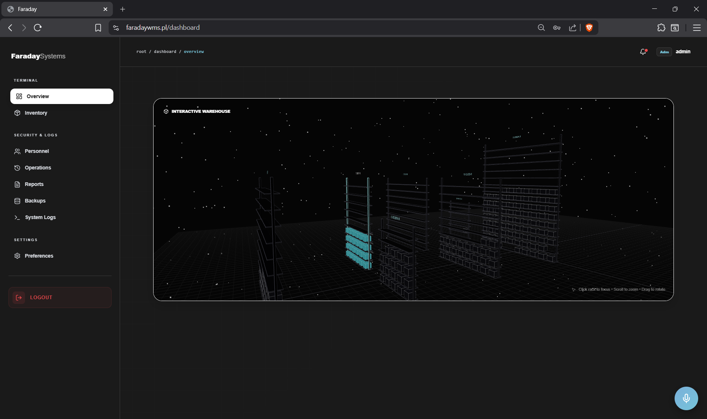
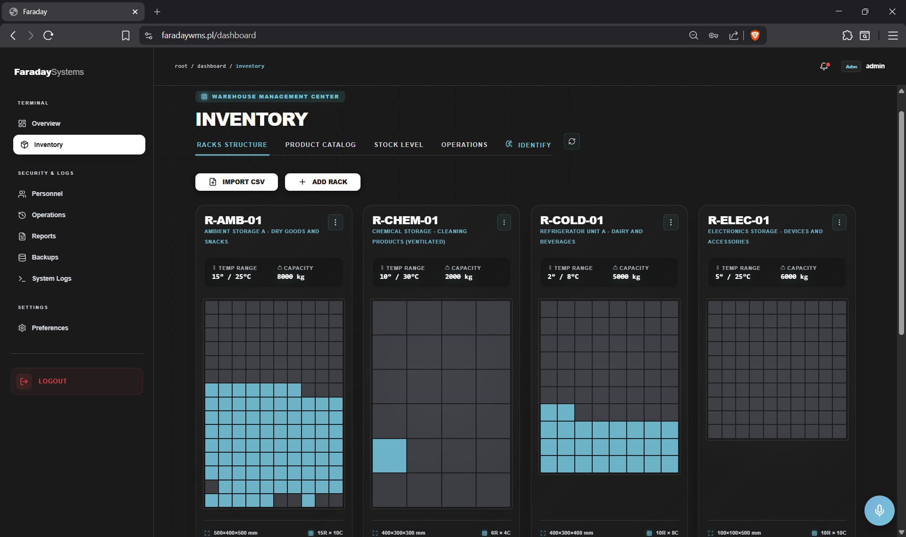
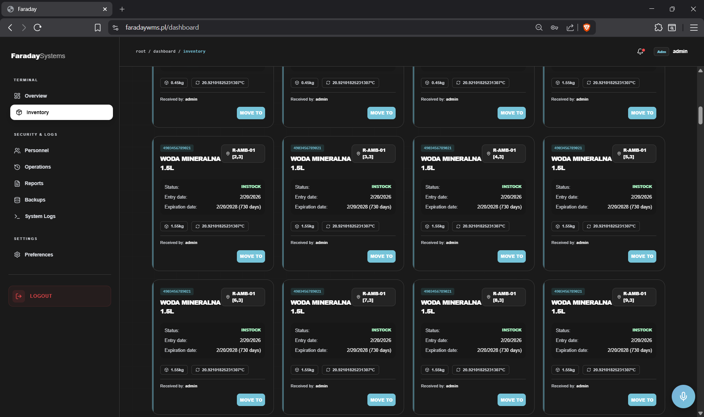
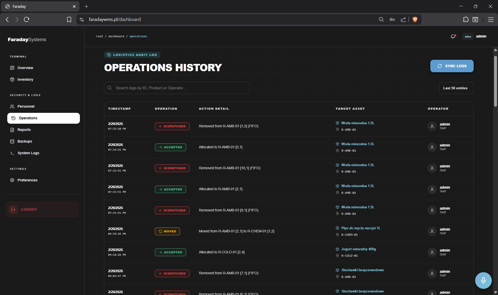
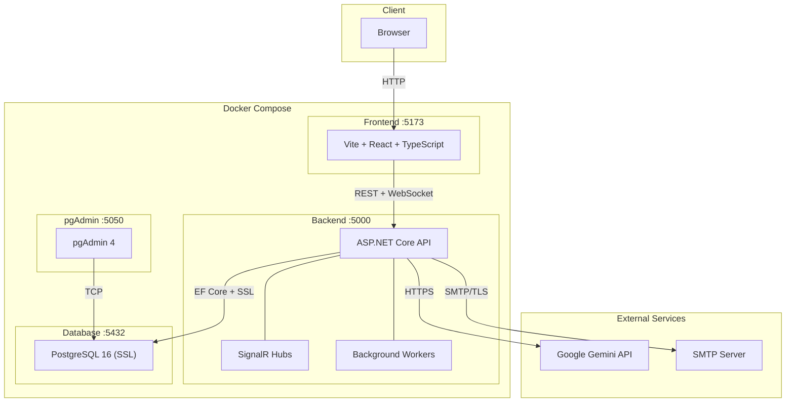

<div align="center">

# Faraday WMS

**Warehouse Management System**

[](https://dotnet.microsoft.com/)
[](https://react.dev/)
[](https://www.typescriptlang.org/)
[](https://www.postgresql.org/)
[](https://www.docker.com/)
[](LICENSE)

Faraday WMS (also known as **FaradaySystems**) is a software solution for managing industrial warehouses. Originally created for the **"Primus Inter Pares"** computer science competition by a 3-person development team, we moved the project to a new repository to polish it. It is being continuously improved in order to turn it into a solid proof of the developers' skills.

</div>

---

## Table of Contents

- [Features](#features)
- [Architecture](#architecture)
- [Screenshots](#screenshots)
- [Tech Stack](#tech-stack)
- [Quick Start](#quick-start)
- [Environment Variables](#environment-variables)
- [License](#license)

---

## Features

### Warehouse Operations
- **Goods Receipt** - automatic optimal storage allocation (algorithm: *First Fit, Bottom-Up, Left-to-Right*)
- **Goods Dispatch** - FIFO strategy (*First In, First Out*)
- **Goods Relocation** - transfer between racks with compatibility validation
- **Full Inventory** - complete warehouse contents listing with operation history

### Monitoring & Alerts
- **Temperature Monitoring** - IoT sensor readings with anomaly detection
- **Weight Monitoring** - weight discrepancy detection (theft protection)
- **Expiration Date Control** - automatic alerts for approaching expiration dates
- **Real-time Notifications** - alerts via SignalR/WebSocket

### Smart Features
- **Voice Control** - natural language command processing via Google Gemini API
- **Product Recognition** - image-based product identification (ResNet50 / ONNX model)
- **Barcode Scanning** - scanner and device camera support

### Security
- **JWT Authentication** with optional **2FA (TOTP)**
- **RBAC Access Control** - roles: `Administrator` / `Warehouse Worker`
- **SSL/TLS** - encrypted database connection
- **Automatic Backups** - AES-256-CBC encrypted, every 24h
- **Soft Delete** - data is never physically removed

### User Interface
- **3D Warehouse Visualization** - interactive Three.js view with navigation
- **Dark / Light Theme**
- **Multi-language Support** - Polish and English
- **Reports & Analytics** - dashboard, rack utilization, sensor history, alarms
- **Log Terminal** - real-time log streaming

---

## Screenshots

### Interactive 3D Warehouse


### Inventory - Rack Structure


### Inventory - Current Stock


### Operations History


---

## Architecture

The system consists of four containerized components communicating within a Docker network:



| Component | Technology | Port | Role |
|-----------|-----------|------|------|
| Frontend | Vite + React 19 + TypeScript | `5173` | SPA - user interface |
| Backend | ASP.NET Core (.NET 10.0) | `5000` | REST API, WebSocket, business logic |
| Database | PostgreSQL 16 Alpine | `5432` | Data persistence (SSL) |
| pgAdmin | pgAdmin 4 | `5050` | Database administration |

---

## Tech Stack

### Backend
| Technology | Purpose |
|-----------|---------|
| ASP.NET Core (.NET 10.0) | Web framework, REST API |
| Entity Framework Core | ORM, database migrations |
| PostgreSQL 16 | Relational database |
| SignalR | WebSocket communication (alerts, logs) |
| BCrypt | Password hashing |
| JWT Bearer | Authentication tokens |
| OtpNet | 2FA authentication (TOTP) |
| ONNX Runtime + ResNet50 | Image-based product recognition |
| MailKit | Email delivery (SMTP) |
| Google Gemini API | Voice command processing |

### Frontend
| Technology | Purpose |
|-----------|---------|
| React 19 | UI library |
| TypeScript | Static typing |
| Vite 7 | Bundler and dev server |
| Three.js / React Three Fiber | 3D warehouse visualization |
| Radix UI | Accessible UI components (Dialog, Tabs, Tooltip…) |
| Sass / SCSS | CSS styling |
| Axios | HTTP communication |
| SignalR Client | WebSocket (real-time alerts and logs) |
| html5-qrcode / ScanApp | Barcode scanning |

### Infrastructure
| Technology | Purpose |
|-----------|---------|
| Docker & Docker Compose | Containerization and orchestration |
| Lefthook | Git hooks |
| ESLint + Prettier | Code linting and formatting |

---

## Quick Start

### Requirements

- [Docker Desktop](https://www.docker.com/products/docker-desktop/) - the only requirement to run the project

### Setup

1. **Clone the repository**
   ```bash
   git clone https://github.com/TOK7O/Faraday.git
   cd Faraday
   ```

2. **Create a `.env` file** in the project root directory using the following template:
   ```env
   DB_HOST=localhost
   DB_PORT=5432
   DB_USER=faraday_admin
   DB_PASSWORD=<your_database_password>
   DB_NAME=faraday_db

   PGADMIN_EMAIL=admin@faraday.com
   PGADMIN_PASSWORD=<your_pgadmin_password>

   BACKUP_ENCRYPTION_KEY=<32_character_key>
   BACKUP_ENCRYPTION_IV=<16_character_iv>

   SMTP_SERVER=smtp.gmail.com
   SMTP_PORT=587
   SMTP_EMAIL=<your_email>
   SMTP_PASSWORD=<app_password>
   SMTP_NAME=Faraday Systems

   GEMINI_API_KEY=<your_gemini_key>

   JWT_KEY=<long_secret_key_for_signing_tokens>
   JWT_ISSUER=FaradayServer
   JWT_AUDIENCE=FaradayClient
   ```
   > Replace values in `< >` with your own data. The `.env` file is ignored by Git.

3. **Generate SSL certificates** (one-time)
   ```bash
   bash generate-certs.sh
   ```

4. **Start the containers**
   ```bash
   docker compose up -d --build
   ```

   > The first startup may take a few minutes - Docker will pull images and build containers.

5. **Open the application**

   | Service | URL |
   |---------|-----|
   | Application | [http://localhost:5173](http://localhost:5173) |
   | API (Swagger) | [http://localhost:5000/swagger](http://localhost:5000/swagger) |
   | pgAdmin | [http://localhost:5050](http://localhost:5050) |

6. **Log in** with the default administrator credentials:
   ```
   Username:  admin
   Password:  admin123
   ```

### Useful Commands

```bash
# Stop containers
docker compose down

# Full reset (delete all data)
docker compose down -v
```

---

## Environment Variables

Configuration is stored in the `.env` file in the project root directory:

| Variable | Description |
|----------|-------------|
| `DB_HOST`, `DB_PORT`, `DB_USER`, `DB_PASSWORD`, `DB_NAME` | PostgreSQL database connection |
| `JWT_KEY`, `JWT_ISSUER`, `JWT_AUDIENCE` | JWT token configuration |
| `BACKUP_ENCRYPTION_KEY`, `BACKUP_ENCRYPTION_IV` | Backup encryption keys (AES-256) |
| `SMTP_SERVER`, `SMTP_PORT`, `SMTP_EMAIL`, `SMTP_PASSWORD` | Email configuration (SMTP) |
| `GEMINI_API_KEY` | Google Gemini API key |
| `CLIENT_APP_BASE_URL` | Frontend base URL |

---

## License

This project is licensed under the [MIT License](LICENSE).

---

<div align="center">

**Faraday WMS** - *Primus Inter Pares* competition project

</div>
