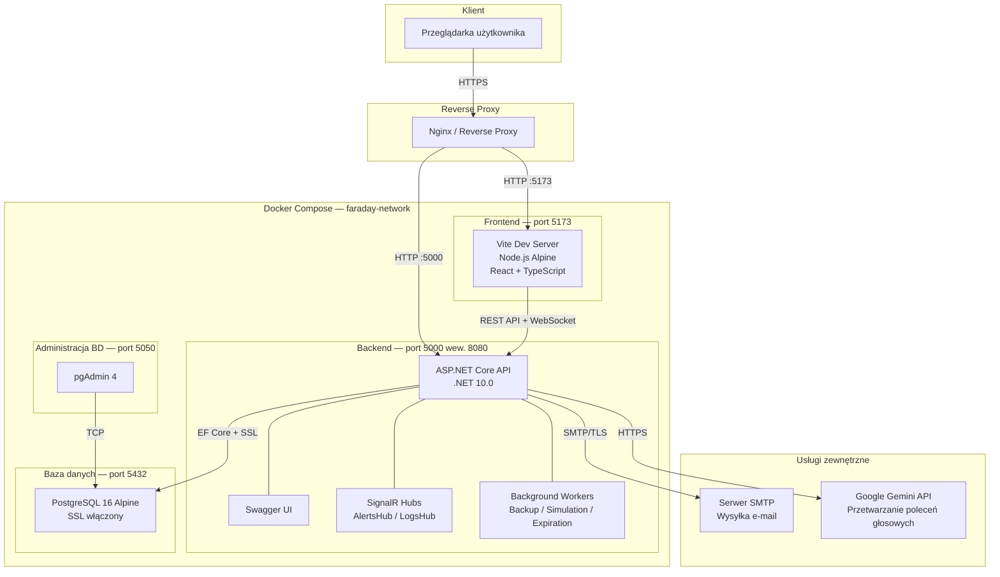
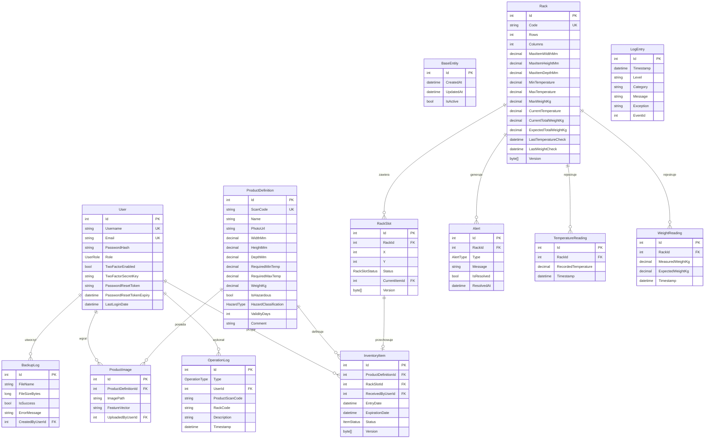

# Dokumentacja Techniczna — Faraday WMS

## 1. Wprowadzenie

Faraday WMS (Warehouse Management System) to kompleksowy system zarządzania magazynem, zaprojektowany do obsługi pełnego cyklu życia towarów w środowisku magazynowym. System umożliwia przyjmowanie, wydawanie i przemieszczanie towarów, monitorowanie warunków środowiskowych (temperatura, waga), zarządzanie alertami, generowanie raportów analitycznych oraz automatyczne tworzenie kopii zapasowych bazy danych. Dodatkowo system oferuje rozpoznawanie produktów na podstawie obrazu (AI) oraz przetwarzanie poleceń głosowych z wykorzystaniem modelu Gemini.

Aplikacja została zbudowana w architekturze klient-serwer, gdzie backend oparty jest na platformie ASP.NET Core, a frontend wykorzystuje Vite z TypeScript. Całość jest orkiestrowana za pomocą Docker Compose.

---

## 2. Architektura systemu

System składa się z czterech głównych kontenerów Docker, komunikujących się w ramach wewnętrznej sieci mostkowej (bridge network) o nazwie `faraday-network`.

### Diagram architektury

### Opis komponentów architektury

| Komponent | Technologia | Port | Rola |
|---|---|---|---|
| Frontend | Vite + React + TypeScript, Node.js Alpine | 5173 | Interfejs użytkownika SPA |
| Backend API | ASP.NET Core (.NET 10.0) | 5000 → 8080 | Logika biznesowa, REST API, WebSocket |
| Baza danych | PostgreSQL 16 Alpine | 5432 | Persystencja danych z szyfrowaniem SSL |
| pgAdmin | pgAdmin 4 | 5050 | Administracja bazą danych |
| Reverse Proxy | Nginx (zalecany) | 80/443 | Terminacja SSL, routing, load balancing |

Backend wykorzystuje wieloetapowy obraz Docker (multi-stage build) — w pierwszym etapie kompiluje aplikację przy użyciu SDK .NET 10.0, a w drugim uruchamia ją na lekkim obrazie runtime. Dodatkowo instaluje klienta PostgreSQL (`postgresql-client`), który jest wymagany do operacji tworzenia i przywracania kopii zapasowych za pomocą narzędzi `pg_dump` i `pg_restore`.

Frontend uruchamiany jest w trybie deweloperskim (`npm run dev --host`) na obrazie Node.js Alpine.

Połączenie z bazą danych jest szyfrowane za pomocą SSL — certyfikat (`server.crt`) i klucz prywatny (`server.key`) są montowane jako wolumeny do kontenera PostgreSQL. Klucz prywatny jest kopiowany wewnątrz kontenera w celu ustawienia odpowiednich uprawnień (chmod 600).

---

## 3. Diagram encji (ERD)

Poniższy diagram przedstawia model danych systemu wraz z relacjami między encjami.

---

## 4. Model danych

Wszystkie encje dziedziczą po klasie abstrakcyjnej `BaseEntity`, która dostarcza wspólne pola: identyfikator (`Id`), znacznik czasu utworzenia (`CreatedAt`), znacznik czasu ostatniej modyfikacji (`UpdatedAt`) oraz flagę aktywności (`IsActive`) używaną do mechanizmu miękkiego usuwania (soft delete).

Kontekst bazy danych (`FaradayDbContext`) konfiguruje globalny filtr zapytań, który automatycznie wyklucza rekordy oznaczone jako nieaktywne (`IsActive = false`) ze wszystkich standardowych zapytań. Zapewnia to, że usunięte dane nie pojawiają się w wynikach bez konieczności dodawania warunków filtrujących w każdym zapytaniu.

### 4.1. User (Użytkownik)

Encja reprezentująca użytkownika systemu. Posiada unikalne indeksy na polach `Username` i `Email`. Hasło jest przechowywane w formie skrótu kryptograficznego (hash) generowanego przez algorytm BCrypt.

System definiuje dwie role użytkowników poprzez enumerację `UserRole`:
- **Administrator** — pełny dostęp do wszystkich funkcji, w tym zarządzania użytkownikami, logami i kopiami zapasowymi.
- **WarehouseWorker** (Pracownik magazynu) — dostęp do operacji magazynowych, produktów i podstawowych raportów.

Użytkownik może włączyć uwierzytelnianie dwuskładnikowe (2FA) oparte na algorytmie TOTP (Time-based One-Time Password). Po włączeniu, klucz tajny jest przechowywany w polu `TwoFactorSecretKey`.

### 4.2. ProductDefinition (Definicja produktu)

Encja opisująca typ produktu — jego parametry fizyczne (wymiary w milimetrach, waga w kilogramach), wymagania temperaturowe (zakres minimalnej i maksymalnej temperatury przechowywania), klasyfikację zagrożeń oraz okres ważności w dniach.

Pole `ScanCode` jest unikalne i służy do identyfikacji produktu za pomocą kodu kreskowego lub QR.

Klasyfikacja zagrożeń wykorzystuje enumerację flagową `HazardType`, co pozwala na przypisanie wielu klasyfikacji jednocześnie (np. produkt może być jednocześnie łatwopalny i toksyczny). Dostępne flagi to: `Explosive` (wybuchowy), `Flammable` (łatwopalny), `Oxidizing` (utleniający), `Toxic` (toksyczny), `Corrosive` (żrący), `RadioActive` (radioaktywny), `Environmental` (zagrażający środowisku).

### 4.3. Rack i RackSlot (Regał i Slot regałowy)

Encja `Rack` reprezentuje fizyczny regał magazynowy z unikalnym kodem identyfikacyjnym. Definiuje ograniczenia fizyczne: maksymalne wymiary przedmiotów (szerokość, wysokość, głębokość), zakres dopuszczalnych temperatur, maksymalną nośność w kilogramach oraz wymiary siatki slotów (liczba wierszy i kolumn).

Przy tworzeniu regału system automatycznie generuje siatkę obiektów `RackSlot` o wymiarach `Rows × Columns`. Każdy slot jest identyfikowany przez współrzędne `X` (kolumna) i `Y` (wiersz) i posiada status: `Available` (dostępny) lub `Reserved` (zarezerwowany).

Regał przechowuje bieżące odczyty sensorów: aktualną temperaturę (`CurrentTemperature`), zmierzoną wagę całkowitą (`CurrentTotalWeightKg`) oraz obliczoną wagę oczekiwaną (`ExpectedTotalWeightKg`).

Zarówno `Rack`, `RackSlot` jak i `InventoryItem` wykorzystują mechanizm optymistycznej kontroli współbieżności (optimistic concurrency) za pomocą pola `Version` (znacznik czasowy). Zapobiega to konfliktom przy jednoczesnych modyfikacjach tego samego rekordu przez wielu użytkowników.

### 4.4. InventoryItem (Element magazynowy)

Reprezentuje konkretną sztukę produktu aktualnie znajdującą się w magazynie. Powiązany jest z definicją produktu (`ProductDefinition`), slotem regałowym (`RackSlot`) oraz użytkownikiem, który go przyjął (`ReceivedByUser`).

Posiada datę przyjęcia (`EntryDate`) oraz opcjonalną datę ważności (`ExpirationDate`), obliczaną automatycznie na podstawie pola `ValidityDays` definicji produktu.

### 4.5. Alert

Encja reprezentująca alert systemowy powiązany z regałem. Typy alertów definiuje enumeracja `AlertType`:
- `TemperatureMismatch` — temperatura poza dopuszczalnym zakresem regału.
- `WeightMismatch` — rozbieżność wagowa (potencjalny brak towaru).
- `ExpirationWarning` — zbliżający się termin ważności.
- `ExpirationExpired` — przekroczony termin ważności.

Alerty mogą być automatycznie rozwiązywane, gdy warunki wrócą do normy.

### 4.6. Pozostałe encje

- **OperationLog** — rejestruje operacje magazynowe (przyjęcie, wydanie, przemieszczenie, korekta, kopia zapasowa, przywrócenie).
- **BackupLog** — rejestruje historia operacji tworzenia kopii zapasowych.
- **TemperatureReading / WeightReading** — historyczne odczyty sensorów temperatury i wagi.
- **ProductImage** — obraz referencyjny produktu wraz z wektorem cech (feature vector) do rozpoznawania obrazem.
- **LogEntry** — wpis logu aplikacji przechowywany w buforze pamięciowym.

---

## 5. Warstwa usług (Services)

### 5.1. AuthService — Uwierzytelnianie i zarządzanie użytkownikami

Odpowiada za cały cykl życia uwierzytelniania: logowanie, rejestrację, zarządzanie tokenami JWT, uwierzytelnianie dwuskładnikowe (2FA) oraz zarządzanie hasłami.

**Logowanie** weryfikuje dane uwierzytelniające za pomocą BCrypt i generuje token JWT zawierający identyfikator użytkownika, nazwę, rolę oraz adres e-mail. Token jest podpisywany kluczem symetrycznym konfigurowanym przez zmienną środowiskową `JWT_KEY`. Po pomyślnym logowaniu aktualizowana jest data ostatniego logowania.

**Uwierzytelnianie dwuskładnikowe (2FA)** wykorzystuje algorytm TOTP (biblioteka OtpNet). Przy konfiguracji generowany jest losowy 20-bajtowy klucz tajny zakodowany w Base32. Użytkownik musi zweryfikować kod TOTP przed aktywacją 2FA. Okno walidacji jest ustawione na 90 sekund, aby uwzględnić ewentualne rozbieżności zegarów.

**Resetowanie hasła** generuje unikalny token (GUID) z jednogodzinnym okresem ważności i wysyła link resetujący na adres e-mail użytkownika za pośrednictwem usługi EmailService.

System zawiera mechanizmy zabezpieczające przed usunięciem lub modyfikacją konta administratora, gdy w systemie istnieje tylko jeden administrator.

### 5.2. OperationService — Operacje magazynowe

Orkiestruje trzy kluczowe operacje magazynowe, z których każda jest realizowana w ramach transakcji bazodanowej zapewniającej atomowość.

**Przyjęcie towaru (Inbound):** Na podstawie kodu kreskowego produktu wyszukuje definicję produktu, a następnie deleguje do `WarehouseAlgorithmService` znalezienie optymalnego slotu. Tworzy nowy `InventoryItem`, przypisuje go do wybranego slotu, zmienia status slotu na `Reserved` i loguje operację.

**Wydanie towaru (Outbound):** Implementuje strategię FIFO (First In, First Out) — wyszukuje najstarszy element danego produktu w magazynie (na podstawie daty przyjęcia). Zwalnia slot, zmienia jego status na `Available`, usuwa element z bazy i loguje operację.

**Przemieszczenie towaru (Movement):** Przenosi konkretny element między slotami. Waliduje istnienie slotów źródłowego i docelowego, sprawdza kompatybilność docelowego regału z produktem (wymiary, temperatura, nośność), zwalnia slot źródłowy i rezerwuje docelowy.

### 5.3. WarehouseAlgorithmService — Algorytm alokacji slotów

Stanowi „mózg" systemu WMS — określa optymalną lokalizację składowania dla przyjmowanego towaru. Implementuje strategię **First Fit, Bottom-Up, Left-to-Right** z wielowymiarową walidacją ograniczeń.

Proces alokacji przebiega następująco:
1. Filtruje regały spełniające ograniczenia wymiarowe (regał musi pomieścić produkt).
2. Filtruje regały spełniające ograniczenia temperaturowe (zakres operacyjny regału musi mieścić się w bezpiecznym zakresie produktu).
3. Dla każdego kandydackiego regału sprawdza nośność (suma wag aktualnych elementów plus nowy produkt nie może przekroczyć limitu).
4. Wyszukuje pierwszy wolny slot, sortując od najniższego wiersza (Y) do najwyższego, a w ramach wiersza od lewej (X) do prawej.

### 5.4. MonitoringService — Monitorowanie warunków środowiskowych

Przetwarza dane telemetryczne z sensorów IoT i monitoruje stan zapasów.

**Przetwarzanie odczytów sensorów** (`ProcessRackReadingAsync`): Aktualizuje bieżący stan regału, oblicza wagę oczekiwaną na podstawie elementów w bazie danych, zapisuje odczyty historyczne do tabel `TemperatureReadings` i `WeightReadings`, a następnie analizuje anomalie.

Wykrywanie anomalii obejmuje:
- **Analiza temperatury** — alert, gdy temperatura przekracza skonfigurowany zakres regału. Tolerancja: brak.
- **Analiza wagi (wykrywanie kradzieży)** — alert, gdy zmierzona waga jest niższa od oczekiwanej o więcej niż 0,5 kg.

Alerty są automatycznie rozwiązywane, gdy odczyty powrócą do normy, co zapobiega zaleganiu nieaktualnych alertów.

**Sprawdzanie dat ważności** (`CheckExpirationDatesAsync`): Skanuje wszystkie elementy na stanie, grupuje je według produktu i regału, a następnie generuje alerty `ExpirationWarning` (zbliżający się termin) lub `ExpirationExpired` (przekroczony termin). Próg ostrzegawczy jest konfigurowalny (domyślnie 7 dni).

### 5.5. BackupService — Kopie zapasowe

Zarządza tworzeniem i przywracaniem zaszyfrowanych kopii zapasowych bazy danych PostgreSQL.

**Tworzenie kopii** wykorzystuje zewnętrzne narzędzie `pg_dump` w formacie custom (`-Fc`). Wygenerowany plik jest szyfrowany algorytmem AES-256-CBC z kluczem i wektorem inicjalizacji (IV) pobieranymi ze zmiennych środowiskowych. Zaszyfrowany plik otrzymuje rozszerzenie `.enc`. Operacja jest rejestrowana w tabeli `BackupLog`.

**Przywracanie kopii** odszyfrowuje plik, a następnie uruchamia `pg_restore` z flagą `--clean` (usuwanie istniejących obiektów przed przywróceniem). Przed przywróceniem system terminuje wszystkie aktywne połączenia z bazą danych (oprócz własnego), aby uniknąć blokad.

### 5.6. ImageRecognitionService — Rozpoznawanie obrazem

Implementuje rozpoznawanie produktów na podstawie obrazów z wykorzystaniem modelu sieci neuronowej ResNet50 w formacie ONNX.

**Przesyłanie obrazów referencyjnych:** Dla każdego produktu można przesłać do 10 obrazów referencyjnych (limit konfigurowalny). Każdy obraz jest zapisywany na dysku, po czym wyodrębniany jest wektor cech o wymiarze 2048 elementów. Obraz jest skalowany do rozdzielczości 224×224 pikseli i normalizowany zgodnie ze standardem ImageNet.

**Rozpoznawanie produktu:** Przesłany obraz jest przetwarzany przez model ResNet50, a uzyskany wektor cech jest porównywany z wektorami referencyjnymi za pomocą miary podobieństwa kosinusowego (cosine similarity). Progi dopasowania: poniżej 70% — brak rozpoznania, 70-85% — dobre dopasowanie, powyżej 85% — doskonałe dopasowanie.

### 5.7. VoiceCommandService — Polecenia głosowe

Przetwarza polecenia głosowe użytkowników (w formie tekstu) na operacje systemowe za pośrednictwem Google Gemini API.

Proces przebiega następująco:
1. Tekst polecenia jest wysyłany do Gemini API wraz ze szczegółowym promptem systemowym opisującym dostępne endpointy API.
2. Gemini generuje strukturalny plan wykonania (JSON) zawierający sekwencję kroków z metodami HTTP, endpointami i parametrami.
3. System wykonuje kroki sekwencyjnie, routując każdy do odpowiedniej usługi (Product, Operation, Rack, Report).
4. Wyniki są podstawiane do szablonu odpowiedzi za pomocą systemu zmiennych (`{{zmienna.właściwość}}`).

### 5.8. ReportService — Raporty i analizy

Generuje dane analityczne i raporty operacyjne:
- **Statystyki dashboardu** — zagregowane metryki: slots zajęte/wolne, waga, elementy z kończącą się ważnością, operacje dzienne.
- **Podsumowanie inwentaryzacji** — grupowanie po produkcie z ilościami i najbliższymi datami ważności.
- **Elementy z kończącą się ważnością** — filtrowane po konfigurowalnym progu dni z lokalizacją.
- **Wykorzystanie regałów** — procentowe obłożenie slotów i nośności każdego regału.
- **Historia temperatury/wagi** — historyczne odczyty sensorów z możliwością filtrowania.
- **Historia alertów** — pełna historia alertów (rozwiązane i aktywne).
- **Naruszenia temperaturowe** — raporty o naruszeniach limitów regałów i wymagań produktów.
- **Pełna inwentaryzacja** — kompletny spis zawartości magazynu ze wszystkimi szczegółami.

### 5.9. EmailService — Wysyłka e-mail

Obsługuje wysyłkę wiadomości e-mail za pośrednictwem protokołu SMTP z szyfrowaniem StartTLS. Wykorzystuje bibliotekę MailKit. Aktualnie implementuje wysyłkę e-maili resetowania hasła z szablonem HTML w języku polskim. Konfiguracja SMTP jest ładowana ze zmiennych środowiskowych.

### 5.10. AlertNotificationService — Powiadomienia w czasie rzeczywistym

Rozgłasza alerty do podłączonych klientów za pośrednictwem SignalR. Wykorzystuje hub `AlertsHub` do wyemitowania zdarzenia `NewAlertCreated` do wszystkich połączonych klientów, co umożliwia natychmiastowe wyświetlenie alertu na dashboardzie operatora bez konieczności odświeżania strony.

---

## 6. Endpointy API

Wszystkie endpointy wymagają autoryzacji tokenem JWT (nagłówek `Authorization: Bearer <token>`), chyba że zaznaczono inaczej.

### 6.1. Uwierzytelnianie (`/api/auth`)

| Metoda | Endpoint | Opis | Dostęp |
|---|---|---|---|
| POST | `/login` | Logowanie (zwraca JWT) | Publiczny |
| POST | `/register` | Rejestracja użytkownika | Publiczny |
| POST | `/setup-2fa` | Konfiguracja 2FA | Zalogowany |
| POST | `/disable-2fa` | Wyłączenie 2FA | Zalogowany |
| POST | `/change-password` | Zmiana hasła | Zalogowany |
| POST | `/forgot-password` | Żądanie resetu hasła | Publiczny |
| POST | `/reset-password` | Reset hasła tokenem | Publiczny |
| GET | `/users` | Lista użytkowników | Administrator |
| PUT | `/users/{id}` | Aktualizacja użytkownika | Administrator |
| DELETE | `/users/{id}` | Usunięcie użytkownika | Administrator |

### 6.2. Produkty (`/api/product`)

| Metoda | Endpoint | Opis |
|---|---|---|
| GET | `/` | Lista wszystkich produktów |
| GET | `/{id}` | Produkt po ID |
| GET | `/scanCode/{code}` | Produkt po kodzie skanowania |
| POST | `/` | Utworzenie produktu |
| PUT | `/{id}` | Aktualizacja produktu |
| DELETE | `/{id}` | Usunięcie produktu (soft delete) |
| POST | `/import-csv` | Import masowy z pliku CSV |

### 6.3. Regały (`/api/rack`)

| Metoda | Endpoint | Opis |
|---|---|---|
| GET | `/` | Lista regałów |
| GET | `/{id}` | Regał po ID |
| POST | `/` | Utworzenie regału (auto-generuje sloty) |
| PUT | `/{id}` | Aktualizacja regału |
| DELETE | `/{id}` | Usunięcie regału (soft delete) |
| POST | `/import-csv` | Import masowy z pliku CSV |

### 6.4. Operacje magazynowe (`/api/operation`)

| Metoda | Endpoint | Opis |
|---|---|---|
| POST | `/inbound` | Przyjęcie towaru |
| POST | `/outbound` | Wydanie towaru (FIFO) |
| POST | `/move` | Przemieszczenie towaru |
| GET | `/history` | Historia operacji |

### 6.5. Raporty (`/api/report`)

| Metoda | Endpoint | Opis |
|---|---|---|
| GET | `/dashboard-stats` | Statystyki dashboardu |
| GET | `/inventory-summary` | Podsumowanie inwentaryzacji |
| GET | `/full-inventory` | Pełny raport inwentaryzacyjny |
| GET | `/expiring-items` | Elementy kończące ważność |
| GET | `/rack-utilization` | Wykorzystanie regałów |
| GET | `/temperature-history` | Historia temperatury |
| GET | `/weight-history` | Historia wagi |
| GET | `/alert-history` | Historia alertów |
| GET | `/active-alerts` | Aktywne alerty |
| GET | `/rack-temperature-violations` | Naruszenia temperaturowe regałów |
| GET | `/item-temperature-violations` | Naruszenia temperaturowe produktów |

### 6.6. Kopie zapasowe (`/api/backup`) — tylko Administrator

| Metoda | Endpoint | Opis |
|---|---|---|
| POST | `/create` | Tworzenie kopii zapasowej |
| GET | `/download/{fileName}` | Pobieranie kopii |
| GET | `/history` | Historia kopii |
| POST | `/restore` | Przywracanie kopii |

### 6.7. Pozostałe endpointy

- **Rozpoznawanie obrazem** (`/api/image-recognition`) — przesyłanie obrazów referencyjnych, rozpoznawanie produktów, zarządzanie obrazami.
- **Polecenia głosowe** (`/api/voice`) — przetwarzanie poleceń tekstowych.
- **Logi** (`/api/logs`) — pobieranie i czyszczenie logów (tylko Administrator).
- **Symulacja** (`/api/simulation`) — manualne wywoływanie anomalii temperatury i wagi (tylko Administrator, cel demonstracyjny).

---

## 7. Zadania w tle (Background Workers)

System uruchamia trzy usługi działające w tle jako `BackgroundService` ASP.NET Core:

### 7.1. SimulationBackgroundWorker

Symuluje dane z sensorów IoT dla celów demonstracyjnych i testowych. W konfigurowalnych interwałach (domyślnie co 30 sekund) generuje odczyty temperatury i wagi dla każdego aktywnego regału.

Normalne warunki symulowane są z niewielkim szumem wokół wartości idealnych. Z konfigurowalnym prawdopodobieństwem (domyślnie 1 zdarzenie na godzinę) generuje anomalie — losowo wybiera jeden regał i symuluje albo skok temperatury (15°C ponad maksimum), albo spadek wagi (2-10 kg poniżej oczekiwanej).

### 7.2. BackupBackgroundWorker

Automatycznie tworzy kopie zapasowe bazy danych co 24 godziny za pomocą `PeriodicTimer`. Deleguje operację do `BackupService`.

### 7.3. ExpirationMonitoringWorker

Sprawdza daty ważności elementów magazynowych w konfigurowalnych interwałach (domyślnie co 1 godzinę). Uruchamia sprawdzenie natychmiast po starcie aplikacji, a następnie cyklicznie. Deleguje do `MonitoringService.CheckExpirationDatesAsync`.

---

## 8. Komunikacja w czasie rzeczywistym (SignalR)

System wykorzystuje dwa huby SignalR do komunikacji WebSocket:

### 8.1. AlertsHub (`/hubs/alerts`)

Kanał rozgłoszeniowy dla alertów krytycznych. Gdy `MonitoringService` wykryje anomalię, `AlertNotificationService` emituje zdarzenie `NewAlertCreated` do wszystkich podłączonych klientów. Nie wymaga autoryzacji — alertów powinni słuchać wszyscy operatorzy.

### 8.2. LogsHub (`/hubs/logs`)

Kanał streamingu logów aplikacji w czasie rzeczywistym, chroniony przez RBAC (Role-Based Access Control) — dostęp mają wyłącznie użytkownicy z rolą `Administrator`. Przy połączeniu wysyła historię ostatnich 1000 wpisów logów. Klient może subskrybować konkretne poziomy logów za pomocą metody `SetLogLevelFilter`, co włącza filtrowanie po stronie serwera.

Token JWT dla połączeń SignalR jest przekazywany jako parametr zapytania (`access_token`), ponieważ WebSocket nie obsługuje nagłówków HTTP w standardowy sposób.

---

## 9. Bezpieczeństwo

### 9.1. Uwierzytelnianie i autoryzacja

- **JWT Bearer** — tokeny podpisywane kluczem symetrycznym z konfigurowanym wydawcą (issuer) i odbiorcą (audience).
- **RBAC** — kontrola dostępu oparta na rolach z dwoma poziomami: Administrator i WarehouseWorker.
- **2FA (TOTP)** — opcjonalne uwierzytelnianie dwuskładnikowe z 90-sekundowym oknem walidacji.
- **BCrypt** — hashowanie haseł algorytmem BCrypt z automatycznym saltingiem.

### 9.2. Ochrona danych

- **SSL/TLS** — szyfrowane połączenie z bazą danych PostgreSQL.
- **Szyfrowanie kopii zapasowych** — AES-256-CBC z kluczami ze zmiennych środowiskowych.
- **CORS** — ograniczenie dostępu do API wyłącznie z adresu URL frontendu.
- **Soft delete** — dane nie są fizycznie usuwane, jedynie oznaczane jako nieaktywne.
- **Optymistyczna kontrola współbieżności** — zapobieganie konfliktom przy jednoczesnych modyfikacjach.

### 9.3. Zmienne środowiskowe

Wrażliwe dane konfiguracyjne są przechowywane w pliku `.env` i nie są commitowane do repozytorium:

| Zmienna | Opis |
|---|---|
| `DB_HOST`, `DB_PORT`, `DB_USER`, `DB_PASSWORD`, `DB_NAME` | Połączenie z bazą danych |
| `JWT_KEY`, `JWT_ISSUER`, `JWT_AUDIENCE` | Konfiguracja tokenów JWT |
| `BACKUP_ENCRYPTION_KEY`, `BACKUP_ENCRYPTION_IV` | Klucze szyfrowania kopii zapasowych |
| `SMTP_SERVER`, `SMTP_PORT`, `SMTP_EMAIL`, `SMTP_PASSWORD`, `SMTP_NAME` | Konfiguracja poczty |
| `GEMINI_API_KEY` | Klucz API Google Gemini |
| `CLIENT_APP_BASE_URL` | Adres bazowy aplikacji frontendowej |

---

## 10. Frontend

Aplikacja frontendowa jest zbudowana w oparciu o React z TypeScript, wykorzystując bundler Vite. Komunikuje się z backendem poprzez REST API (zmienna `VITE_API_URL`).

### Struktura modułowa

| Katalog | Zawartość |
|---|---|
| `pages/auth` | Strony logowania, resetowania i przypominania hasła |
| `pages/dashboard` | Główny dashboard z widokami: przegląd, inwentaryzacja, personel, logi, kopie zapasowe, raporty, preferencje, historia operacji |
| `pages/home` | Strona główna |
| `pages/docs` | Strona dokumentacji |
| `components/layouts/dashboard` | Komponenty layoutu: sidebar, nawigacja, powiadomienia, formularz zmiany hasła, wizualizacja regałów, karty produktów, modale |
| `components/ui` | Atomowe komponenty UI (pola formularzy, spinner) |
| `components/ProtectedRoute` | Komponent chroniący trasy wymagające autoryzacji |
| `context` | Konteksty React (prawdopodobnie autoryzacja) |
| `api` | Klient API |
| `types` | Definicje typów TypeScript |
| `styles` | Globalne arkusze stylów |

Frontend zawiera interaktywną wizualizację regałów (`RackVisualGrid`, `RackCard`), modale do operacji na produktach i regałach (`ProductModal`, `RackModal`, `MoveModal`), system powiadomień w czasie rzeczywistym (`NotificationsPopover`) oraz pływający przycisk sterowania głosowego (`VoiceControlFAB`).

---

## 11. Inicjalizacja i uruchomienie

Przy starcie aplikacji backend automatycznie:
1. Stosuje wszystkie oczekujące migracje bazy danych (`context.Database.Migrate()`).
2. Tworzy domyślnego użytkownika administratora (login: `admin`, hasło: `admin123`), jeśli baza jest pusta.
3. Konfiguruje middleware: autoryzację JWT, CORS, Swagger z obsługą Bearer tokenów, endpointy SignalR (`/hubs/alerts`, `/hubs/logs`).
4. Uruchamia zadania w tle (symulacja, kopie zapasowe, monitoring ważności).

Swagger UI jest dostępny pod adresem `/swagger` i pozwala na testowanie API z autoryzacją JWT.
