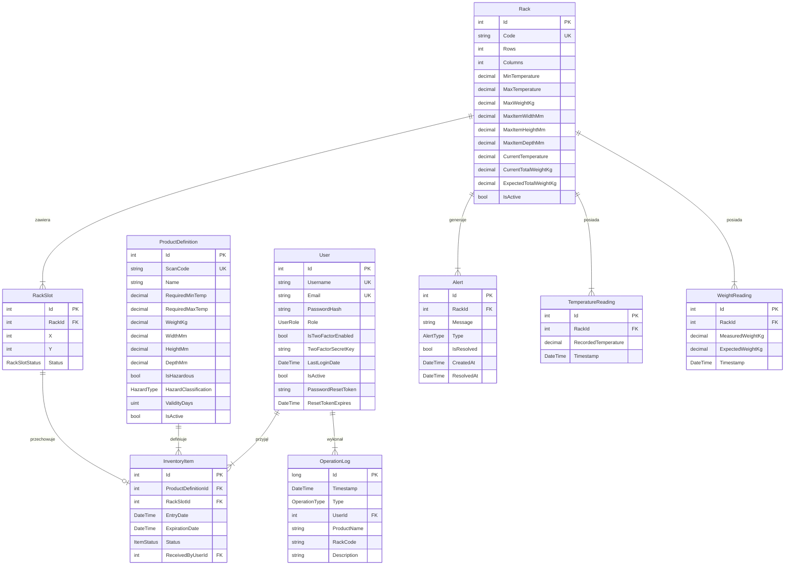
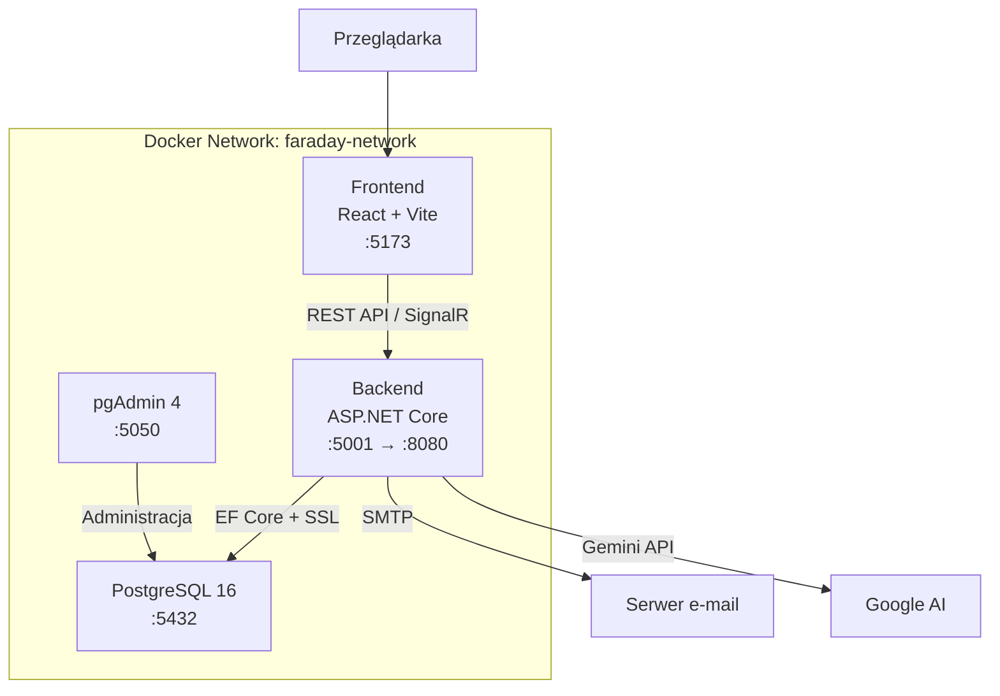

# Specyfikacja Techniczna Systemu Faraday WMS

**Data:** 11 luty 2026  
**Wersja:** 1.0

---

## Spis treści

1. [Wstęp](#1-wstęp)
2. [Opis ogólny](#2-opis-ogólny)
3. [Model danych](#3-model-danych)
4. [Specyfikacja API](#4-specyfikacja-api)
5. [Komunikacja Real-Time (SignalR)](#5-komunikacja-real-time-signalr)
6. [Procesy w tle (Background Workers)](#6-procesy-w-tle-background-workers)
7. [Algorytmy biznesowe](#7-algorytmy-biznesowe)
8. [Architektura i infrastruktura](#8-architektura-i-infrastruktura)
9. [Struktura kodu źródłowego](#9-struktura-kodu-źródłowego)
10. [Instrukcja użytkownika](#10-instrukcja-użytkownika)
11. [Inne elementy](#11-inne-elementy)

---

## 1. Wstęp

### 1.1 Cel dokumentu
Niniejszy dokument stanowi kompletną specyfikację techniczną systemu **Faraday WMS** (Warehouse Management System) — inteligentnego systemu zarządzania magazynem. Dokument opisuje architekturę, model danych, API, algorytmy biznesowe oraz infrastrukturę wdrożeniową.

### 1.2 Konwencje
- **Pogrubienie** — kluczowe terminy, nazwy technologii.
- `Monospace` — nazwy plików, klas, funkcji, endpointów API.
- Priorytety dziedziczą się z punktu nadrzędnego na podpunkty.
- Kody HTTP oznaczają: `200` sukces, `201` utworzono, `400` błąd walidacji, `401` brak autoryzacji, `404` nie znaleziono, `409` konflikt, `428` wymagany 2FA, `500` błąd serwera.

### 1.3 Odbiorcy
| Odbiorca | Cel |
|---|---|
| Programiści | Zrozumienie architektury, API, modelu danych |
| Administratorzy | Wdrożenie, konfiguracja Docker, zmienne środowiskowe |
| Testerzy | Przypadki testowe, walidacja endpointów |
| Stakeholderzy | Weryfikacja zakresu funkcjonalnego |

### 1.4 Zakres projektu
System Faraday realizuje:
- Zarządzanie infrastrukturą magazynową (regały, sloty, towary).
- Operacje logistyczne: przyjęcie (Inbound), wydanie (Outbound), przesunięcie (Move).
- Monitoring czujników temperatury i wagi w czasie rzeczywistym.
- System alertów z automatyczną detekcją naruszeń.
- Uwierzytelnianie dwuskładnikowe (2FA/TOTP) i autoryzację opartą na rolach.
- Rozpoznawanie produktów na podstawie obrazu (Gemini AI).
- Sterowanie głosowe operacjami magazynowymi.
- Zarządzanie kopiami zapasowymi bazy danych (szyfrowane backupy).
- Terminal logów systemowych w czasie rzeczywistym (SignalR).

### 1.5 Referencje
| Zasób | Odnośnik |
|---|---|
| React 18 | https://reactjs.org/ |
| .NET 8 | https://dotnet.microsoft.com/ |
| SignalR | https://learn.microsoft.com/aspnet/core/signalr/ |
| Entity Framework Core | https://learn.microsoft.com/ef/core/ |
| PostgreSQL 16 | https://www.postgresql.org/ |
| Swagger/OpenAPI | Dostępny pod `/swagger` w trybie Development |

---

## 2. Opis ogólny

### 2.1 Opis produktu
Faraday WMS to samodzielna aplikacja webowa nowej generacji do zarządzania magazynem. System łączy klasyczne operacje WMS (przyjęcia, wydania, przesunięcia) z zaawansowaną analityką sensoryczną (temperatura, waga), rozpoznawaniem wizualnym produktów oraz sterowaniem głosowym.

### 2.2 Interfejsy systemowe

| Komponent | Technologia | Wersja |
|---|---|---|
| Frontend | React + TypeScript + Vite | React 18, Vite 5 |
| Backend | ASP.NET Core | .NET 8 |
| Baza danych | PostgreSQL | 16 (Alpine) |
| ORM | Entity Framework Core | 8.x |
| Real-time | SignalR | wbudowany w .NET 8 |
| Konteneryzacja | Docker + Docker Compose | — |
| Administracja BD | pgAdmin 4 | — |

### 2.3 Interfejs użytkownika
Aplikacja kliencka to SPA (Single Page Application).
Główne sekcje:

| Widok | Opis |
|---|---|
| **Dashboard** | Statystyki zajętości, wagi, operacji dziennych |
| **Inwentarz** | Interaktywna siatka regałów, katalog produktów, operacje |
| **Personel** | Zarządzanie użytkownikami, rolami, 2FA |
| **Historia operacji** | Chronologiczny log operacji magazynowych |
| **Raporty** | 4 zakładki: Inwentarz, Utylizacja, Czujniki, Alarmy |
| **Kopie zapasowe** | Tworzenie, pobieranie, przywracanie backupów |
| **Terminal logów** | Konsola logów systemowych w czasie rzeczywistym (SignalR) |
| **Preferencje** | Motyw, język (PL/EN), zmiana hasła, konfiguracja 2FA |

### 2.4 Interfejs oprogramowania
- **Baza danych**: Entity Framework Core z PostgreSQL (SSL). Automatyczne migracje przy starcie.
- **Autoryzacja**: JWT Bearer Tokens z konfigurowalnymi parametrami (Issuer, Audience, Key).
- **2FA**: TOTP (Time-based One-Time Password) kompatybilny z Google Authenticator / Microsoft Authenticator.
- **E-mail**: SMTP do wysyłki linków resetowania hasła.
- **AI**: Gemini API do rozpoznawania obrazu i przetwarzania komend głosowych.

### 2.5 Interfejs komunikacyjny
- **REST API**: JSON over HTTPS, prefix `/api/[controller]`.
- **WebSockets**: SignalR Hubs (`/hubs/logs`, `/hubs/alerts`), token JWT przesyłany w Query String.
- **CORS**: Skonfigurowany dla `localhost:5173` i `localhost:3000`.

---

## 3. Model danych

### 3.1 Diagram relacji encji (ERD)



### 3.2 Typy wyliczeniowe (Enums)

| Enum | Wartości |
|---|---|
| `UserRole` | `Administrator`, `WarehouseWorker` |
| `ItemStatus` | `InStock`, `OutStock` |
| `RackSlotStatus` | `Available`, `Occupied`, `Blocked` |
| `OperationType` | `Inbound`, `Outbound`, `Move`, `ProductCreated`, `ProductUpdated`, `ProductDeleted`, `RackCreated`, `RackUpdated`, `RackDeleted` |
| `AlertType` | `TemperatureMismatch`, `WeightMismatch`, `ExpirationWarning`, `ExpirationExpired` |
| `HazardType` | `None`, `Flammable`, `Toxic`, `Corrosive`, `Explosive`, `Radioactive` |

---

## 4. Specyfikacja API

Wszystkie endpointy wymagają nagłówka `Authorization: Bearer <JWT>`, chyba że zaznaczono inaczej.  
Prefix bazowy: `http://localhost:5001/api`

### 4.1 AuthController — `/api/Auth`

Zarządzanie uwierzytelnianiem, użytkownikami i bezpieczeństwem.

| Metoda | Endpoint | Opis | Autoryzacja | Kody |
|---|---|---|---|---|
| `POST` | `/register` | Rejestracja nowego użytkownika | Admin | `200`, `400` |
| `POST` | `/login` | Logowanie (JWT + opcjonalny 2FA) | Publiczny | `200`, `401`, `428` |
| `POST` | `/setup-2fa` | Generowanie klucza 2FA i QR code | Zalogowany | `200` |
| `POST` | `/enable-2fa` | Weryfikacja i aktywacja 2FA | Zalogowany | `200`, `400` |
| `POST` | `/disable-2fa` | Wyłączenie 2FA | Zalogowany | `200` |
| `GET` | `/2fa-status` | Status 2FA użytkownika | Zalogowany | `200` |
| `POST` | `/change-password` | Zmiana hasła | Zalogowany | `200`, `400` |
| `POST` | `/refresh-token` | Odświeżenie tokenu JWT | Zalogowany | `200` |
| `GET` | `/users` | Lista wszystkich użytkowników | Admin | `200` |
| `PUT` | `/users/{id}` | Edycja użytkownika (rola, status) | Admin | `200`, `400` |
| `POST` | `/users/{id}/reset-password` | Reset hasła użytkownika | Admin | `200`, `400` |
| `POST` | `/users/{id}/reset-2fa` | Reset 2FA użytkownika | Admin | `200` |
| `POST` | `/forgot-password` | Wysłanie emaila z linkiem resetowania | Publiczny | `200` |
| `POST` | `/reset-password` | Reset hasła tokenem z maila | Publiczny | `200`, `400` |

**Sekwencja logowania z 2FA:**
```
1. POST /login {username, password} → 428 (2FA wymagane)
2. POST /login {username, password, twoFactorCode} → 200 {token}
```

### 4.2 OperationController — `/api/Operation`

Operacje magazynowe: przyjęcie, wydanie, przesunięcie.

| Metoda | Endpoint | Opis | Kody |
|---|---|---|---|
| `POST` | `/inbound` | Przyjęcie towaru (automatyczna alokacja slotu) | `200`, `404`, `409` |
| `POST` | `/outbound` | Wydanie towaru (FIFO — najstarszy egzemplarz) | `200`, `404` |
| `POST` | `/move` | Przesunięcie towaru między slotami | `200`, `400`, `404` |
| `GET` | `/history?limit=N` | Historia operacji | `200` |

**Przykład — Inbound Request:**
```json
{
  "barcode": "PROD-001",
  "quantity": 1
}
```

**Przykład — Inbound Response:**
```json
{
  "operationId": 42,
  "rackCode": "R-01",
  "slotX": 0,
  "slotY": 2,
  "message": "Item stored in R-01 [0,2]"
}
```

**Przykład — Move Request:**
```json
{
  "barcode": "PROD-001",
  "sourceRackCode": "R-01",
  "sourceSlotX": 0,
  "sourceSlotY": 2,
  "targetRackCode": "R-02",
  "targetSlotX": 1,
  "targetSlotY": 0
}
```

### 4.3 ProductController — `/api/Product`

CRUD katalogu produktów i import CSV.

| Metoda | Endpoint | Opis | Autoryzacja | Kody |
|---|---|---|---|---|
| `GET` | `/` | Lista aktywnych produktów | Zalogowany | `200` |
| `GET` | `/{id}` | Szczegóły produktu po ID | Zalogowany | `200`, `404` |
| `GET` | `/scanCode/{scanCode}` | Wyszukiwanie po kodzie kreskowym | Zalogowany | `200`, `404` |
| `POST` | `/` | Utworzenie produktu | Admin | `201`, `400` |
| `PUT` | `/{id}` | Aktualizacja produktu | Admin | `200`, `404`, `409` |
| `DELETE` | `/{id}` | Soft-delete produktu | Admin | `204` |
| `POST` | `/import` | Import CSV (multipart/form-data) | Admin | `200`, `400` |

**Walidacja przy aktualizacji**: Jeśli zmiana wymiarów lub temperatury koliduje z towarami aktualnie składowanymi w regałach, API zwraca `409 Conflict`.

### 4.4 RackController — `/api/Rack`

CRUD infrastruktury magazynowej.

| Metoda | Endpoint | Opis | Autoryzacja | Kody |
|---|---|---|---|---|
| `GET` | `/` | Lista wszystkich regałów | Zalogowany | `200` |
| `GET` | `/{id}` | Szczegóły regału + sloty | Zalogowany | `200`, `404` |
| `POST` | `/` | Utworzenie regału | Admin | `201`, `400` |
| `PUT` | `/{id}` | Aktualizacja konfiguracji | Admin | `200`, `404`, `409` |
| `DELETE` | `/{id}` | Soft-delete (tylko pusty regał) | Admin | `204`, `400` |
| `POST` | `/import` | Import CSV | Admin | `200`, `400` |

### 4.5 ReportController — `/api/Report`

Raporty analityczne i metryki dashboardu.

| Metoda | Endpoint | Opis | Parametry |
|---|---|---|---|
| `GET` | `/dashboard-stats` | Statystyki główne | — |
| `GET` | `/inventory-summary` | Podsumowanie inwentarza wg produktu | — |
| `GET` | `/full-inventory` | Pełny raport inwentarzowy | — |
| `GET` | `/expiring-items` | Towary z kończącym się terminem | `?days=7` |
| `GET` | `/rack-utilization` | Zajętość i obciążenie regałów | — |
| `GET` | `/temperature-history` | Historia temperatur | `?rackId&fromDate&toDate&limit` |
| `GET` | `/weight-history` | Historia pomiarów wagi | `?rackId&fromDate&toDate&limit` |
| `GET` | `/alert-history` | Pełna historia alertów | `?rackId&fromDate&toDate` |
| `GET` | `/active-alerts` | Aktywne (nierozwiązane) alerty | — |
| `GET` | `/rack-temperature-violations` | Naruszenia temp. regałów | `?rackId&fromDate&toDate&limit` |
| `GET` | `/item-temperature-violations` | Naruszenia temp. towarów | `?fromDate&toDate` |

**Limity**: Parametr `limit` jest ograniczony do zakresu `1–1000`.

### 4.6 BackupController — `/api/Backup`

Zarządzanie kopiami zapasowymi. **Tylko Administratorzy.**

| Metoda | Endpoint | Opis | Kody |
|---|---|---|---|
| `GET` | `/history` | Lista backupów na serwerze | `200` |
| `POST` | `/create` | Ręczne utworzenie backupu | `200`, `500` |
| `GET` | `/download/{fileName}` | Pobieranie pliku backupu | `200`, `404` |
| `POST` | `/restore/{fileName}` | Przywrócenie BD z backupu | `200`, `404`, `500` |

**Uwaga**: Operacja `restore` nadpisuje całą bazę danych. Pliki backupowe są szyfrowane kluczem AES (`BACKUP_ENCRYPTION_KEY`).

### 4.7 ImageRecognitionController — `/api/ImageRecognition`

Rozpoznawanie produktów na podstawie obrazu (Computer Vision).

| Metoda | Endpoint | Opis | Autoryzacja |
|---|---|---|---|
| `POST` | `/upload-reference/{scanCode}` | Upload zdjęć referencyjnych (max 10/produkt) | Zalogowany |
| `POST` | `/recognize` | Rozpoznanie produktu z obrazu | Zalogowany |
| `GET` | `/reference-images/product/{id}` | Zdjęcia referencyjne po ID produktu | Zalogowany |
| `GET` | `/reference-images/scancode/{scanCode}` | Zdjęcia referencyjne po kodzie | Zalogowany |
| `GET` | `/reference-images/count/{id}` | Liczba zdjęć referencyjnych | Zalogowany |
| `DELETE` | `/reference-images/{imageId}` | Usunięcie zdjęcia referencyjnego | Admin |
| `GET` | `/images/{guid}` | Pobranie pliku obrazu po GUID | **Publiczny** |

### 4.8 VoiceController — `/api/Voice`

Przetwarzanie komend głosowych (tekst → akcja).

| Metoda | Endpoint | Opis |
|---|---|---|
| `POST` | `/command` | Przetworzenie komendy głosowej |

**Przykład żądania:**
```json
{
  "commandText": "przyjmij produkt PROD-001"
}
```

### 4.9 SimulationController — `/api/Simulation`

Symulacja awarii (tylko do demonstracji). **Tylko Administratorzy.**

| Metoda | Endpoint | Opis |
|---|---|---|
| `POST` | `/trigger-temp-failure/{rackId}` | Symulacja awarii temperatury (+15°C ponad max) |
| `POST` | `/trigger-theft/{rackId}` | Symulacja kradzieży (-5 kg od oczekiwanej wagi) |

### 4.10 LogsController — `/api/Logs`

Zarządzanie logami systemowymi. **Tylko Administratorzy.**

| Metoda | Endpoint | Opis |
|---|---|---|
| `GET` | `/recent?count=500` | Ostatnie logi z bufora (max 1000) |
| `DELETE` | `/clear` | Wyczyść bufor logów |

---

## 5. Komunikacja Real-Time (SignalR)

### 5.1 LogsHub — `/hubs/logs`
Streaming logów systemowych do terminala w czasie rzeczywistym.

| Zdarzenie | Kierunek | Payload |
|---|---|---|
| `ReceiveLog` | Serwer → Klient | `{message: string, level: string, timestamp: string}` |
| `ReceiveConnectionStatus` | Serwer → Klient | `{status: 'connected' \| 'disconnected'}` |

**Autoryzacja**: Token JWT przesyłany w Query String (`?access_token=...`).

### 5.2 AlertsHub — `/hubs/alerts`
Powiadomienia push o nowych alertach.

| Zdarzenie | Kierunek | Payload |
|---|---|---|
| `ReceiveAlert` | Serwer → Klient | `{type: AlertType, message: string, rackCode: string}` |

---

## 6. Procesy w tle (Background Workers)

| Worker | Plik | Opis |
|---|---|---|
| `BackupBackgroundWorker` | `Workers/BackupBackgroundWorker.cs` | Automatyczne tworzenie backupów wg harmonogramu |
| `SimulationBackgroundWorker` | `Workers/SimulationBackgroundWorker.cs` | Symulacja odczytów czujników co określony interwał |
| `ExpirationMonitoringWorker` | `Workers/ExpirationMonitoringWorker.cs` | Monitorowanie dat ważności, generowanie alertów `ExpirationWarning`/`ExpirationExpired` |

---

## 7. Algorytmy biznesowe

### 7.1 Algorytm alokacji towarów (`WarehouseAlgorithmService`)

Metoda `FindBestSlotForProductAsync(productDefinitionId)`:

```
1. Pobierz definicję produktu (wymiary, waga, temperatura).
2. Filtruj regały spełniające warunki:
   a. Regał aktywny (IsActive = true).
   b. Wymiary slotu >= wymiary produktu (Width, Height, Depth).
   c. Zakres temperatur regału MIEŚCI SIĘ w zakresie wymaganym przez produkt.
3. Dla każdego pasującego regału:
   a. Oblicz aktualny ładunek (suma wag towarów w slotach).
   b. Sprawdź, czy dodanie produktu nie przekroczy MaxWeightKg.
   c. Znajdź pierwszy wolny slot (strategia Bottom-Up, Left-to-Right):
      - Sortuj po Y rosnąco (najniższe półki najpierw).
      - Sortuj po X rosnąco (od lewej do prawej).
   d. Jeśli znaleziono — przydziel slot.
4. Jeśli brak wolnych slotów — zwróć wyjątek.
```

### 7.2 FIFO przy wydaniu (Outbound)

System automatycznie wybiera najstarszy egzemplarz produktu (`EntryDate ASC`) do wydania, zapewniając rotację zapasów.

### 7.3 Detekcja naruszeń (`MonitoringService`)

- **Temperatura**: Jeśli `RecordedTemperature` wykracza poza `[Rack.MinTemperature, Rack.MaxTemperature]` → Alert `TemperatureMismatch`.
- **Waga**: Jeśli `|MeasuredWeight - ExpectedWeight| > próg` → Alert `WeightMismatch` (możliwa kradzież).

---

## 8. Architektura i infrastruktura

### 8.1 Diagram architektury



### 8.2 Docker Compose — usługi

| Usługa | Obraz | Port | Opis |
|---|---|---|---|
| `db` | `postgres:16-alpine` | `5432:5432` | Baza danych z SSL, limit 512MB RAM |
| `pgadmin` | `dpage/pgadmin4` | `5050:80` | Interfejs administracyjny bazy |
| `backend` | Custom Dockerfile | `5001:8080` | API + SignalR + Background Workers |
| `frontend` | Custom Dockerfile | `5173:5173` | SPA React (Vite dev server) |

### 8.3 Zmienne środowiskowe (`.env`)

| Zmienna | Opis |
|---|---|
| `DB_HOST`, `DB_PORT`, `DB_NAME`, `DB_USER`, `DB_PASSWORD` | Konfiguracja PostgreSQL |
| `JWT_KEY`, `JWT_ISSUER`, `JWT_AUDIENCE` | Parametry tokenów JWT |
| `BACKUP_ENCRYPTION_KEY`, `BACKUP_ENCRYPTION_IV` | Klucze szyfrowania backupów (AES) |
| `SMTP_SERVER`, `SMTP_PORT`, `SMTP_USER`, `SMTP_PASSWORD` | Konfiguracja serwera pocztowego |
| `GEMINI_API_KEY` | Klucz API do Google Gemini (rozpoznawanie obrazu) |
| `PGADMIN_EMAIL`, `PGADMIN_PASSWORD` | Dane logowania do pgAdmin |

### 8.4 Bezpieczeństwo

| Warstwa | Mechanizm |
|---|---|
| Transport | HTTPS (TLS 1.3), SSL dla PostgreSQL |
| Autoryzacja | JWT Bearer Tokens z walidacją Issuer/Audience/Key |
| Hasła | BCrypt (hashing z solą) |
| 2FA | TOTP (RFC 6238), kompatybilny z Google/Microsoft Authenticator |
| Backupy | Szyfrowanie AES (128/256-bit) |
| CORS | Whitelist origins (localhost:5173, localhost:3000) |
| Role | `Administrator`, `WarehouseWorker` — egzekwowane przez `[Authorize(Roles)]` |

### 8.5 Konto domyślne (Seed)

Przy pierwszym uruchomieniu (pusta tabela `Users`) system tworzy:
- **Login**: `admin`
- **Hasło**: `admin123`
- **Email**: `admin@faraday.com`
- **Rola**: `Administrator`

---

## 9. Struktura kodu źródłowego

### 9.1 Backend (`/backend/Faraday.API`)

```
Faraday.API/
├── Controllers/            # 10 kontrolerów API
│   ├── AuthController.cs           # Autentykacja, użytkownicy, 2FA
│   ├── OperationController.cs      # Inbound, Outbound, Move
│   ├── ProductController.cs        # CRUD produktów, import CSV
│   ├── RackController.cs           # CRUD regałów, import CSV
│   ├── ReportController.cs         # Raporty i analityka
│   ├── BackupController.cs         # Kopie zapasowe
│   ├── ImageRecognitionController.cs # Rozpoznawanie obrazu
│   ├── VoiceController.cs          # Komendy głosowe
│   ├── SimulationController.cs     # Symulacja awarii
│   └── LogsController.cs           # Zarządzanie logami
├── Models/                 # 19 encji danych
│   ├── User.cs, UserRole.cs
│   ├── Rack.cs, RackSlot.cs, RackSlotStatus.cs
│   ├── ProductDefinition.cs, HazardType.cs
│   ├── InventoryItem.cs, ItemStatus.cs
│   ├── OperationLog.cs, OperationType.cs
│   ├── Alert.cs
│   ├── TemperatureReading.cs, WeightReading.cs
│   ├── BackupLog.cs, LogEntry.cs
│   ├── EmailSettings.cs, ProductImage.cs
│   └── BaseEntity.cs
├── DTOs/                   # 8 plików z obiektami transferu danych
│   ├── AuthDtos.cs                 # Login, Register, 2FA, ChangePassword
│   ├── InventoryDtos.cs            # Inbound, Outbound, Move, OperationResult
│   ├── ProductDtos.cs              # Create, Update, ProductDto
│   ├── RackDtos.cs                 # Create, Update, RackDto
│   ├── ReportDtos.cs               # Dashboard, Inventory, Violations
│   ├── BackupHistoryDto.cs
│   ├── ImageRecognitionDtos.cs
│   └── VoiceCommandDtos.cs
├── Services/               # 14 serwisów + 13 interfejsów
│   ├── AuthService.cs              # (22 KB) Logika autentykacji
│   ├── OperationService.cs         # (15 KB) Logika operacji
│   ├── ProductService.cs           # (18 KB) Logika produktów
│   ├── RackService.cs              # (16 KB) Logika regałów
│   ├── ReportService.cs            # (22 KB) Logika raportów
│   ├── BackupService.cs            # (16 KB) pg_dump, szyfrowanie
│   ├── MonitoringService.cs        # (12 KB) Czujniki, detekcja
│   ├── ImageRecognitionService.cs  # (19 KB) Gemini AI
│   ├── VoiceCommandService.cs      # (30 KB) NLP + mapowanie komend
│   ├── WarehouseAlgorithmService.cs # (5 KB) Alokacja slotów
│   ├── EmailService.cs             # (4 KB) Wysyłka SMTP
│   ├── AlertNotificationService.cs # (2 KB) SignalR push
│   ├── LogsService.cs              # (5 KB) Bufor in-memory
│   └── SignalRLoggerProvider.cs    # (4 KB) Custom ILoggerProvider
├── Hubs/                   # 2 huby SignalR
│   ├── LogsHub.cs
│   └── AlertsHub.cs
├── Workers/                # 3 procesy w tle
│   ├── BackupBackgroundWorker.cs
│   ├── SimulationBackgroundWorker.cs
│   └── ExpirationMonitoringWorker.cs
├── Data/
│   └── FaradayDbContext.cs         # Konfiguracja EF Core
├── Program.cs              # Punkt wejścia, DI, middleware
└── appsettings.json
```

### 9.2 Frontend (`/frontend/src`)

```
src/
├── api/
│   └── axios.ts                    # Konfiguracja HTTP, interceptory, wywołania API
├── context/
│   └── LanguageContext.tsx          # Provider i18n (PL/EN)
├── data/
│   ├── pl.json                     # Tłumaczenia PL (~890 linii)
│   └── en.json                     # Tłumaczenia EN (~890 linii)
├── pages/
│   ├── auth/                       # LoginPage, ForgotPasswordPage, ResetPasswordPage
│   └── dashboard/
│       ├── DashboardPage.tsx       # Routing widoków
│       └── views/
│           ├── Inventory/          # InventoryContent, RackGrid, ProductCatalog
│           ├── Personnel/          # PersonnelContent, AddUserModal
│           ├── Operations/         # OperationsHistory
│           ├── Reports/            # ReportsContent (4 zakładki)
│           ├── Backups/            # BackupsContent
│           ├── Logs/               # LogsContent (SignalR terminal)
│           └── Preferences/        # PreferencesContent
├── components/
│   ├── layouts/                    # AuthForm, Sidebar, Modals
│   └── ui/                         # Spinner, Toast, etc.
└── styles/                         # Globalne SCSS
```

---

## 10. Instrukcja użytkownika

### 10.1 Uruchomienie systemu

**Wymagania**: Docker, Docker Compose, Node.js 20+, .NET 8 SDK.

```bash
# 1. Klonowanie repozytorium
git clone <repo-url> && cd Faraday

# 2. Konfiguracja zmiennych środowiskowych
cp .env.example .env   # Uzupełnij wartości

# 3. Generowanie certyfikatów SSL
./generate-certs.sh

# 4. Uruchomienie infrastruktury
docker compose up -d

# 5. Frontend (dev)
cd frontend && npm install && npm run dev
```

### 10.2 Pierwsze logowanie
1. Otwórz `http://localhost:5173`.
2. Zaloguj się: **admin** / **admin123**.
3. Zmień hasło w zakładce **Preferencje → Zmiana hasła**.
4. (Opcjonalnie) Skonfiguruj 2FA w **Preferencje → Bezpieczeństwo**.

### 10.3 Typowy przepływ pracy

```
1. Administrator tworzy definicje produktów (Inwentarz → Katalog Produktów → Dodaj)
2. Administrator tworzy regały (Inwentarz → Regały → Dodaj)
3. Pracownik wykonuje operację Inbound (skanuje kod → system automatycznie przydziela slot)
4. System monitoruje temperaturę i wagę (automatyczne alerty)
5. Pracownik wykonuje operację Outbound (system stosuje FIFO)
6. Administrator monitoruje raporty i alerty
```

---

## 11. Inne elementy

### 11.1 Wielojęzyczność (i18n)
System obsługuje 2 języki: **Polski** i **Angielski**. Tłumaczenia przechowywane w `/frontend/src/data/pl.json` i `en.json`. Zmiana języka: Preferencje → Język.

### 11.2 Interfejs głosowy
Moduł `VoiceCommandService` (30 KB) oraz komponent frontendowy `VoiceControlFAB` przetwarzają komendy tekstowe na akcje magazynowe. System obsługuje pełną bilingwalność (PL/EN) – automatycznie wykrywa język interfejsu i dostosowuje język nasłuchiwania (Speech-to-Text) oraz syntezy odpowiedzi (Text-to-Speech). Obsługuje m.in.: przyjęcie towaru, wydanie, wyszukiwanie, sprawdzenie stanu regału oraz generowanie naturalnych streszczeń stanów magazynowych.

### 11.3 Rozpoznawanie obrazu
Integracja z Google Gemini API. Użytkownik może uploadować zdjęcia referencyjne produktów, a następnie rozpoznawać produkty przez porównanie z biblioteką referencyjną.

### 11.4 Swagger
W trybie Development dostępny pod adresem `http://localhost:5001/swagger`. Zawiera pełną dokumentację interaktywną wszystkich endpointów z możliwością testowania.
