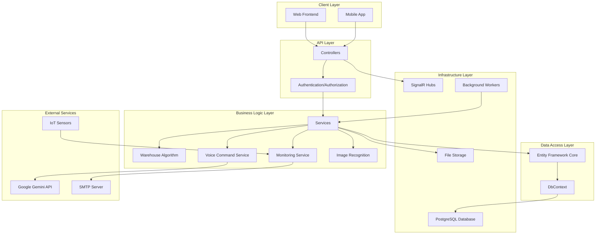
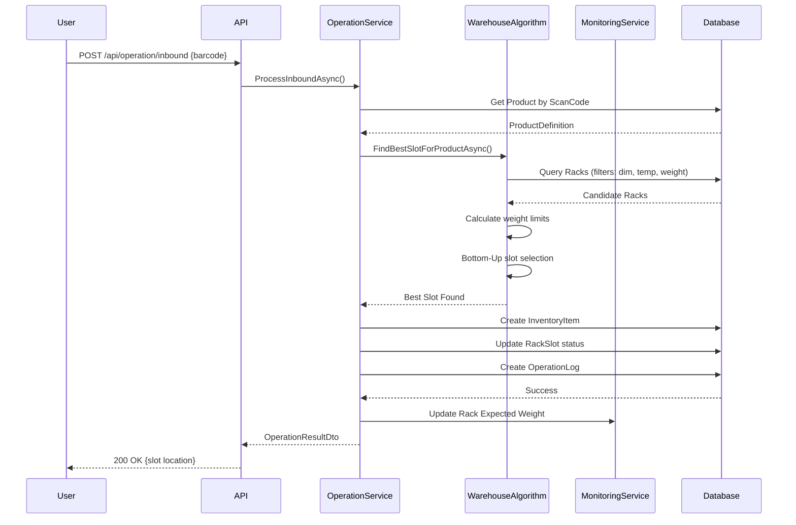
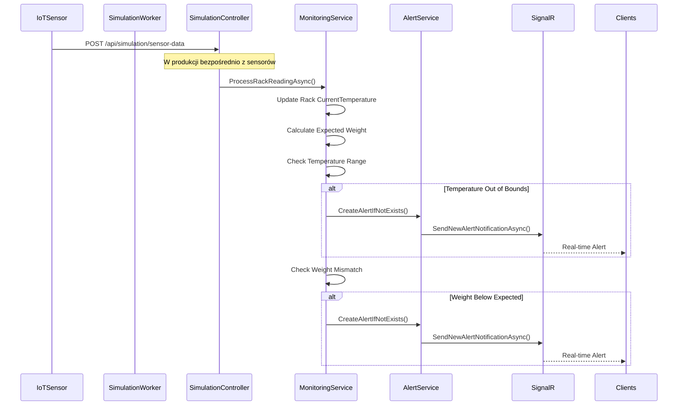
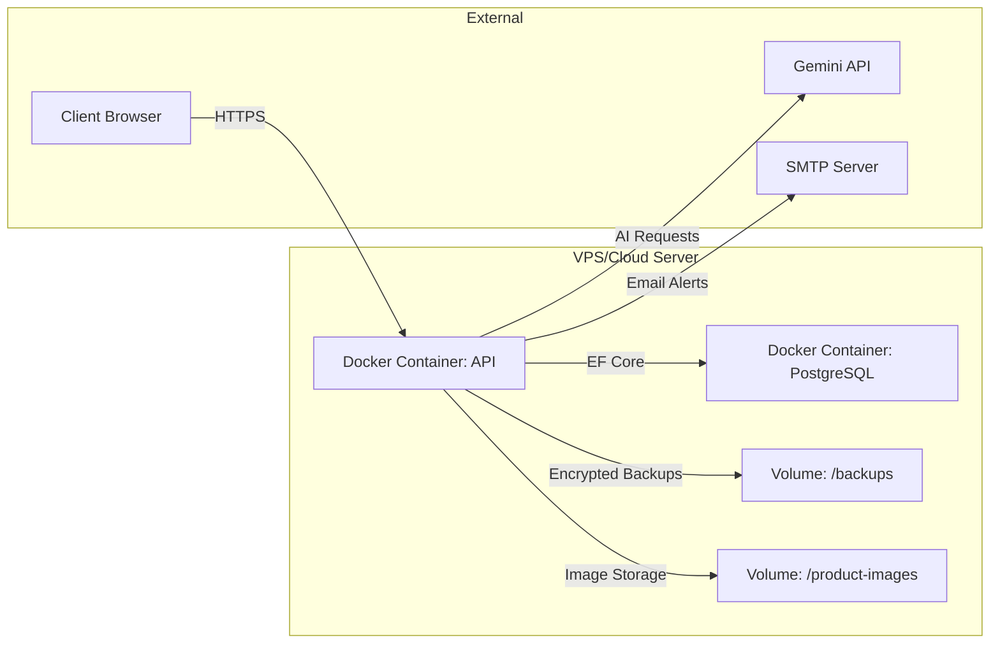
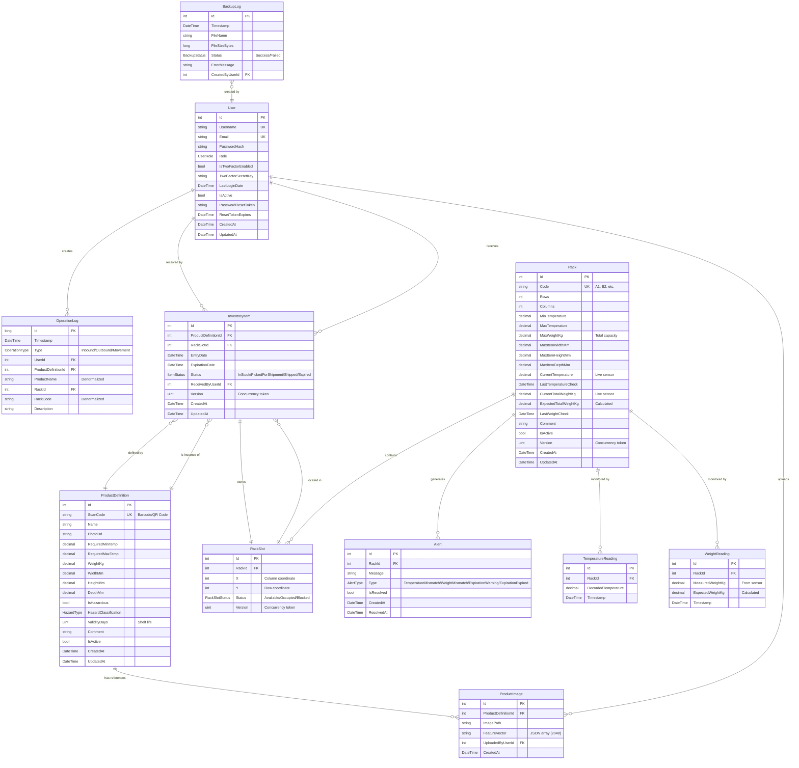
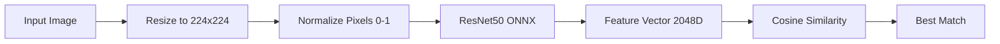
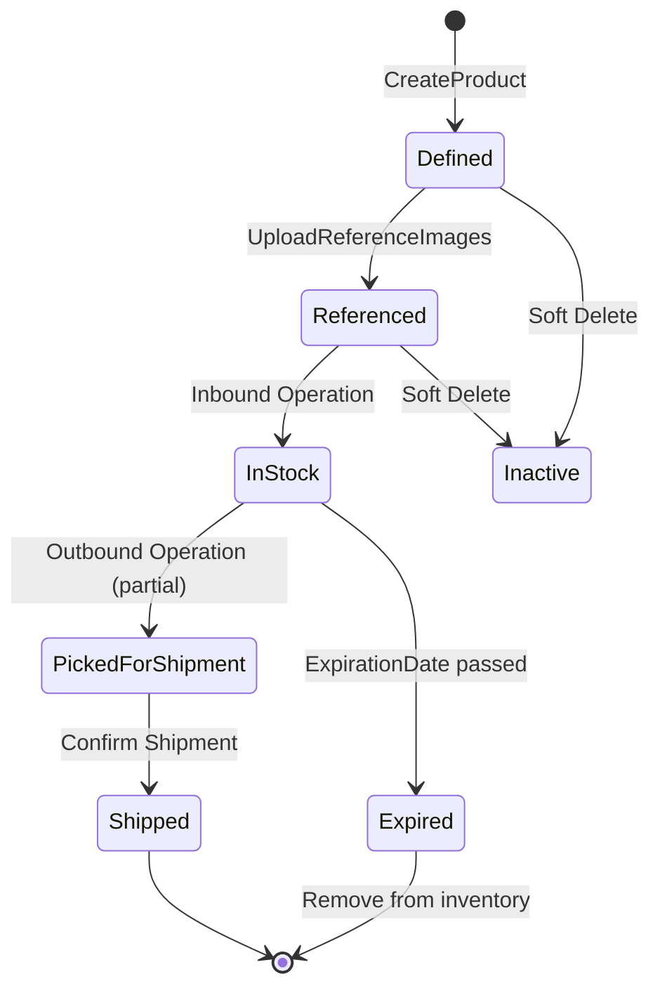
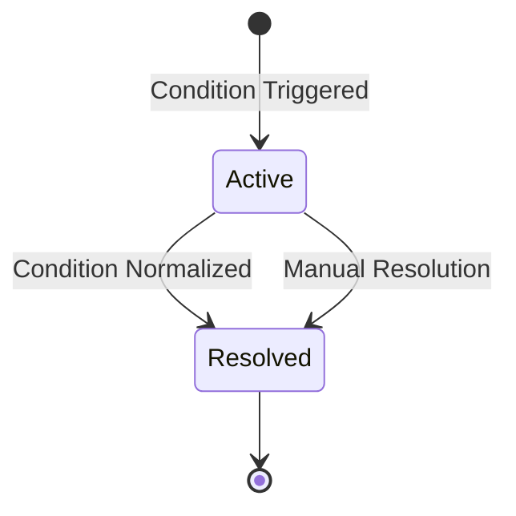
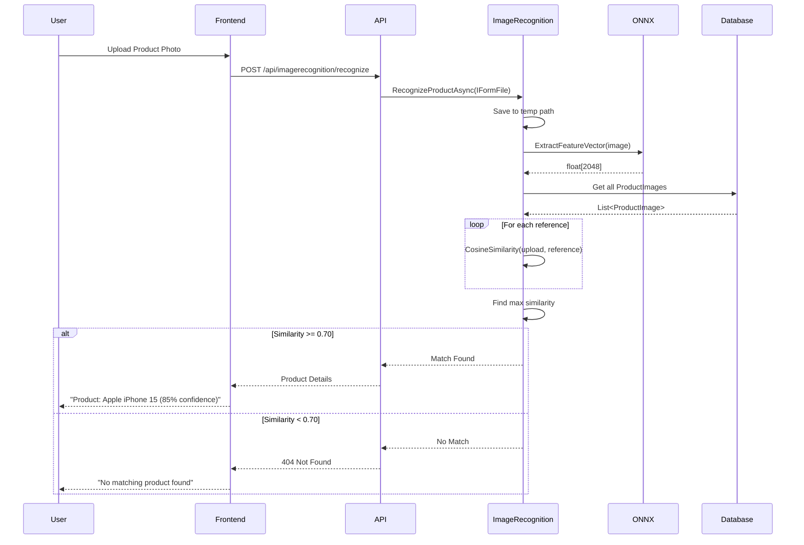

# Faraday WMS - Dokumentacja Techniczna

## Spis Treści

1. [Wprowadzenie](#wprowadzenie)
2. [Architektura Systemu](#architektura-systemu)
3. [Technologie i Narzędzia](#technologie-i-narzędzia)
4. [Model Danych](#model-danych)
5. [Komponenty Systemu](#komponenty-systemu)
6. [Główne Funkcjonalności](#glowne-funkcjonalnosci)
7. [API Endpoints](#api-endpoints)
8. [Background Workers](#background-workers)
9. [Integracje Zewnętrzne](#integracje-zewnetrzne)
10. [Bezpieczeństwo](#bezpieczenstwo)
11. [Deployment i Konfiguracja](#deployment-i-konfiguracja)
12. [Appendix](#appendix)

---

## Wprowadzenie

### Cel Systemu

**Faraday WMS** (Warehouse Management System) to zaawansowany system zarządzania magazynem, który łączy tradycyjne funkcjonalności WMS z nowoczesnymi technologiami AI/ML oraz IoT. System został zaprojektowany do kompleksowego zarządzania magazynem, od przyjęcia towaru przez składowanie, aż po wysyłkę, z uwzględnieniem monitoringu środowiskowego i predykcji problemów.

### Kluczowe Cechy

- **Inteligentne Przydzielanie Slotów** - Algorytm Bottom-Up z walidacją wymiarów, temperatury i wagi
- **Monitoring w Czasie Rzeczywistym** - IoT sensors dla temperatury i wagi z automatycznym alertowaniem
- **Rozpoznawanie Obrazów** - AI-powered identyfikacja produktów przy użyciu ResNet50
- **Sterowanie Głosowe** - Natural language processing przez Google Gemini
- **Automatyczne Backupy** - Zaszyfrowane backupy bazy danych
- **Symulacja Sensorów** - Środowisko testowe bez fizycznego hardware'u
- **Real-time Communication** - SignalR dla logów i alertów

### Dla Kogo Jest Ta Dokumentacja

Dokumentacja ta jest przeznaczona dla:
- Nowych programistów dołączających do zespołu
- Architektów systemowych planujących integracje
- DevOps engineers odpowiedzialnych za deployment
- Technical leads przeprowadzających code review

---

## Architektura Systemu

### Architektura High-Level

System Faraday WMS wykorzystuje architekturę **warstwową (Layered Architecture)** z wyraźnym podziałem odpowiedzialności:



### Przepływ Danych

#### 1. Proces Przyjęcia Towaru (Inbound)



#### 2. Monitoring i Alerty



### Deployment Architecture



---

## Technologie i Narzędzia

### Backend Stack

| Komponent | Technologia | Wersja | Zastosowanie |
|-----------|-------------|--------|--------------|
| Runtime | .NET | 10.0 | Framework aplikacji |
| Language | C# | 13.0 | Język programowania |
| Web Framework | ASP.NET Core | 10.0 | Web API i middleware |
| ORM | Entity Framework Core | 10.0 | Data access layer |
| Database | PostgreSQL | 15+ | Główna baza danych |
| Authentication | JWT Bearer | - | Token-based auth |
| Real-time | SignalR | - | WebSocket communication |
| Image Processing | ImageSharp | 3.x | Przetwarzanie obrazów |
| ML Runtime | ONNX Runtime | - | Model inference |
| Email | MailKit | - | SMTP client |
| QR Codes | QRCoder | - | 2FA QR generation |
| OTP | Otp.NET | - | TOTP implementation |
| CSV Export | CsvHelper | - | Raportowanie |
| Password Hashing | BCrypt.Net | - | Bezpieczne hasła |
| Env Variables | DotNetEnv | - | Configuration |

### AI/ML Models

- **ResNet50-v2-7** (ONNX): Feature extraction dla image recognition
  - Input: 224x224 RGB
  - Output: 2048-dimensional feature vector
  - Similarity metric: Cosine similarity

- **Google Gemini 2.0 Flash**: Natural language understanding
  - Voice command parsing
  - Execution plan generation

### Infrastruktura

- **Docker**: Konteneryzacja aplikacji
- **Docker Compose**: Orkiestracja kontenerów
- **Nginx/Reverse Proxy**: Load balancing i SSL termination (opcjonalnie)

---

## Model Danych

### Entity Relationship Diagram (ERD)



### Kluczowe Relacje i Constrainty

#### Unique Indexes

```sql
-- User
CREATE UNIQUE INDEX idx_user_username ON "Users" ("Username");
CREATE UNIQUE INDEX idx_user_email ON "Users" ("Email");

-- ProductDefinition
CREATE UNIQUE INDEX idx_product_scancode ON "Products" ("ScanCode");

-- Rack
CREATE UNIQUE INDEX idx_rack_code ON "Racks" ("Code");

-- RackSlot
CREATE UNIQUE INDEX idx_rackslot_position ON "RackSlots" ("RackId", "X", "Y");

-- Alert (tylko jeden aktywny alert danego typu na rack)
CREATE UNIQUE INDEX idx_alert_active ON "Alerts" ("RackId", "Type", "IsResolved") 
    WHERE "IsResolved" = false;
```

#### Foreign Key Constraints

```csharp
// InventoryItem -> RackSlot (1:1 relationship, restrict delete)
modelBuilder.Entity<InventoryItem>()
    .HasOne(i => i.Slot)
    .WithOne(s => s.CurrentItem)
    .HasForeignKey<InventoryItem>(i => i.RackSlotId)
    .OnDelete(DeleteBehavior.Restrict); // Nie można usunąć slotu z itemem
```

#### Soft Delete (Global Query Filters)

```csharp
// Automatyczne wykluczenie "usuniętych" rekordów
modelBuilder.Entity<Rack>().HasQueryFilter(r => r.IsActive);
modelBuilder.Entity<ProductDefinition>().HasQueryFilter(p => p.IsActive);
modelBuilder.Entity<User>().HasQueryFilter(u => u.IsActive);

// Aby uzyskać dostęp do "usuniętych":
var allRacks = await _context.Racks.IgnoreQueryFilters().ToListAsync();
```

#### Optimistic Concurrency (Row Versioning)

```csharp
// Entities with Version field
[Timestamp]
public uint Version { get; set; }

// Automatyczna detekcja konfliktów przy SaveChanges()
try {
    await _context.SaveChangesAsync();
} catch (DbUpdateConcurrencyException ex) {
    // Handle conflict: retry lub zwróć błąd do użytkownika
}
```

### Enumeracje

```csharp
public enum UserRole {
    Administrator = 0,
    WarehouseManager = 1,
    WarehouseOperator = 2
}

public enum RackSlotStatus {
    Available = 0,
    Occupied = 1,
    Blocked = 2  // Reserved/Maintenance
}

public enum ItemStatus {
    InStock = 0,
    PickedForShipment = 1,
    Shipped = 2,
    Expired = 3
}

public enum OperationType {
    Inbound = 0,
    Outbound = 1,
    Movement = 2
}

public enum AlertType {
    TemperatureMismatch = 0,
    WeightMismatch = 1,
    ExpirationWarning = 2,
    ExpirationExpired = 3
}

public enum HazardType {
    None = 0,
    Flammable = 1,
    Toxic = 2,
    Corrosive = 3,
    Explosive = 4,
    Radioactive = 5
}

public enum BackupStatus {
    Success = 0,
    Failed = 1
}
```

---

## Komponenty Systemu

### 1. Controllers (API Layer)

Kontrolery obsługują HTTP requests i delegują logikę biznesową do serwisów.

#### AuthController

**Odpowiedzialność**: Uwierzytelnianie i zarządzanie użytkownikami

**Główne Endpointy**:
- `POST /api/auth/login` - Logowanie (JWT + optional 2FA)
- `POST /api/auth/register` - Rejestracja nowego użytkownika
- `POST /api/auth/enable-2fa` - Włączenie TOTP 2FA
- `POST /api/auth/verify-2fa` - Weryfikacja kodu TOTP
- `POST /api/auth/disable-2fa` - Wyłączenie 2FA
- `POST /api/auth/forgot-password` - Generowanie tokenu resetowania hasła
- `POST /api/auth/reset-password` - Reset hasła z tokenem
- `POST /api/auth/change-password` - Zmiana hasła (zalogowany)
- `GET /api/auth/profile` - Pobranie profilu użytkownika

**Authorization**: Większość wymaga `[Authorize]`, z wyjątkiem login/register/forgot/reset

**Kluczowa Logika**:

```csharp
// JWT Token Generation
var claims = new[]
{
    new Claim(ClaimTypes.NameIdentifier, user.Id.ToString()),
    new Claim(ClaimTypes.Name, user.Username),
    new Claim(ClaimTypes.Email, user.Email),
    new Claim(ClaimTypes.Role, user.Role.ToString())
};

var token = new JwtSecurityToken(
    issuer: _configuration["Jwt:Issuer"],
    audience: _configuration["Jwt:Audience"],
    claims: claims,
    expires: DateTime.UtcNow.AddHours(8),
    signingCredentials: credentials
);
```

**2FA Flow**:
1. User włącza 2FA → backend generuje Secret Key
2. Backend zwraca QR Code (data URI) do skanowania w Google Authenticator
3. User weryfikuje pierwszy kod → 2FA aktywne
4. Przy kolejnych logowaniach: po poprawnym hasle wymagany kod TOTP

---

#### ProductController

**Odpowiedzialność**: Zarządzanie definicjami produktów

**Główne Endpointy**:
- `GET /api/product` - Lista wszystkich produktów
- `GET /api/product/{id}` - Szczegóły produktu
- `GET /api/product/scancode/{scanCode}` - Wyszukiwanie po kodzie kreskowym
- `POST /api/product` - Dodanie nowego produktu
- `PUT /api/product/{id}` - Aktualizacja produktu
- `DELETE /api/product/{id}` - Soft delete produktu

**Authorization**: Tylko `Administrator` i `WarehouseManager` mogą tworzyć/edytować

**Walidacja**:
- ScanCode musi być unikalny
- Wymagane pola: Name, Dimensions (Width, Height, Depth), Weight
- Temperatura: RequiredMinTemp < RequiredMaxTemp
- ValidityDays: opcjonalne, jeśli produkt ma termin ważności

---

#### RackController

**Odpowiedzialność**: Zarządzanie regałami i ich slotami

**Główne Endpointy**:
- `GET /api/rack` - Lista wszystkich regałów
- `GET /api/rack/{id}` - Szczegóły regału ze slotami
- `POST /api/rack` - Dodanie nowego regału
- `PUT /api/rack/{id}` - Aktualizacja regału
- `DELETE /api/rack/{id}` - Soft delete regału
- `GET /api/rack/{id}/inventory` - Aktualny inventory w regale

**Kluczowa Logika**:

Po utworzeniu regału system automatycznie generuje sloty:

```csharp
// RackService.CreateRackAsync()
for (int x = 0; x < rack.Columns; x++) {
    for (int y = 0; y < rack.Rows; y++) {
        var slot = new RackSlot {
            RackId = rack.Id,
            X = x,
            Y = y,
            Status = RackSlotStatus.Available
        };
        _context.RackSlots.Add(slot);
    }
}
```

**Walidacja**:
- Code musi być unikalny
- Rows i Columns: 1-1000
- MinTemperature < MaxTemperature
- MaxWeightKg musi być > 0

---

#### OperationController

**Odpowiedzialność**: Operacje magazynowe (przyjęcie, wydanie, przemieszczenie)

**Główne Endpointy**:
- `POST /api/operation/inbound` - Przyjęcie towaru
- `POST /api/operation/outbound` - Wydanie towaru
- `POST /api/operation/move` - Przemieszczenie między slotami
- `GET /api/operation/history` - Historia operacji

**Inbound Flow**:

```csharp
// 1. Walidacja produktu
var product = await _context.Products.FirstOrDefaultAsync(p => p.ScanCode == barcode);

// 2. Znalezienie optymalnego slotu
var slot = await _warehouseAlgorithm.FindBestSlotForProductAsync(product.Id);

// 3. Utworzenie InventoryItem
var item = new InventoryItem {
    ProductDefinitionId = product.Id,
    RackSlotId = slot.Id,
    EntryDate = DateTime.UtcNow,
    ExpirationDate = product.ValidityDays.HasValue 
        ? DateTime.UtcNow.AddDays(product.ValidityDays.Value) 
        : null,
    Status = ItemStatus.InStock,
    ReceivedByUserId = userId
};

// 4. Aktualizacja slotu
slot.Status = RackSlotStatus.Occupied;

// 5. Log operacji
var log = new OperationLog {
    Type = OperationType.Inbound,
    UserId = userId,
    ProductDefinitionId = product.Id,
    ProductName = product.Name,
    RackId = slot.RackId,
    RackCode = slot.Rack.Code,
    Description = $"Inbound: {product.Name} to {slot.Rack.Code}[{slot.X},{slot.Y}]"
};
```

**Outbound Flow**:

```csharp
// 1. Walidacja produktu i dostępności
var items = await _context.InventoryItems
    .Include(i => i.Product)
    .Include(i => i.Slot).ThenInclude(s => s.Rack)
    .Where(i => i.Product.ScanCode == barcode && i.Status == ItemStatus.InStock)
    .OrderBy(i => i.ExpirationDate) // FIFO dla produktów z terminem
    .ThenBy(i => i.EntryDate)       // FIFO dla pozostałych
    .ToListAsync();

if (!items.Any()) throw new InvalidOperationException("No stock available");

// 2. Pobranie pierwszego dostępnego (FIFO)
var item = items.First();

// 3. Aktualizacja statusu
item.Status = ItemStatus.PickedForShipment; // Lub Shipped

// 4. Zwolnienie slotu
item.Slot.Status = RackSlotStatus.Available;

// 5. Log operacji
```

**Movement Flow**:

```csharp
// 1. Walidacja source slot
var sourceSlot = await GetSlotAsync(sourceRackCode, sourceX, sourceY);
if (sourceSlot.CurrentItem == null) throw new Exception("Source slot is empty");

// 2. Walidacja target slot
var targetSlot = await GetSlotAsync(targetRackCode, targetX, targetY);
if (targetSlot.Status != RackSlotStatus.Available) throw new Exception("Target slot not available");

// 3. Walidacja kompatybilności (dimensions, temperature)
var product = sourceSlot.CurrentItem.Product;
var targetRack = targetSlot.Rack;
if (!IsCompatible(product, targetRack)) throw new Exception("Target rack incompatible");

// 4. Transfer
var item = sourceSlot.CurrentItem;
item.RackSlotId = targetSlot.Id;
sourceSlot.Status = RackSlotStatus.Available;
targetSlot.Status = RackSlotStatus.Occupied;

// 5. Log operacji
```

---

#### ReportController

**Odpowiedzialność**: Generowanie raportów i statystyk

**Główne Endpointy**:
- `GET /api/report/dashboard-stats` - Statystyki dla dashboardu
- `GET /api/report/inventory-summary` - Podsumowanie inventory po produktach
- `GET /api/report/expiring-items?days=7` - Lista wygasających produktów
- `GET /api/report/rack-utilization` - Wypełnienie regałów
- `GET /api/report/full-inventory` - Pełny raport inventory
- `GET /api/report/active-alerts` - Aktywne alerty
- `GET /api/report/export/csv` - Export do CSV

**Dashboard Stats Response**:

```json
{
  "totalProducts": 150,
  "totalRacks": 12,
  "totalSlots": 480,
  "occupiedSlots": 324,
  "availableSlots": 156,
  "utilizationPercentage": 67.5,
  "totalInventoryItems": 324,
  "inStockItems": 310,
  "pickedItems": 12,
  "shippedItems": 2,
  "expiredItems": 0,
  "activeAlerts": 3,
  "recentOperations": [...]
}
```

**Expiring Items**:

```csharp
var threshold = DateTime.UtcNow.AddDays(days);
var items = await _context.InventoryItems
    .Include(i => i.Product)
    .Include(i => i.Slot).ThenInclude(s => s.Rack)
    .Where(i => i.Status == ItemStatus.InStock 
             && i.ExpirationDate <= threshold
             && i.ExpirationDate >= DateTime.UtcNow)
    .OrderBy(i => i.ExpirationDate)
    .Select(i => new ExpiringItemDto {
        ProductName = i.Product.Name,
        ScanCode = i.Product.ScanCode,
        RackCode = i.Slot.Rack.Code,
        SlotX = i.Slot.X,
        SlotY = i.Slot.Y,
        ExpirationDate = i.ExpirationDate.Value,
        DaysRemaining = (i.ExpirationDate.Value - DateTime.UtcNow).Days
    })
    .ToListAsync();
```

---

#### ImageRecognitionController

**Odpowiedzialność**: AI-powered rozpoznawanie produktów

**Główne Endpointy**:
- `POST /api/imagerecognition/upload-references` - Upload obrazów referencyjnych
- `POST /api/imagerecognition/recognize` - Rozpoznanie produktu z obrazu
- `GET /api/imagerecognition/product/{scanCode}/images` - Lista referencji
- `DELETE /api/imagerecognition/image/{id}` - Usunięcie obrazu referencyjnego

**Upload References Flow**:

```csharp
// 1. Walidacja (max 10 zdjęć na produkt, max 10MB/file)
if (currentCount + images.Count > MaxReferenceImages) throw new Exception();

// 2. Zapis do /wwwroot/product-images
var fileName = $"{scanCode}_{Guid.NewGuid()}.jpg";
await image.CopyToAsync(fileStream);

// 3. Feature extraction przez ResNet50
var featureVector = await ExtractFeatureVectorAsync(filePath);
// Output: float[2048]

// 4. Zapis do bazy
var productImage = new ProductImage {
    ProductDefinitionId = product.Id,
    ImagePath = fileName,
    FeatureVector = JsonSerializer.Serialize(featureVector),
    UploadedByUserId = userId
};
```

**Recognition Flow**:

```csharp
// 1. Extract features z uploadowanego zdjęcia
var uploadedFeatures = await ExtractFeatureVectorAsync(tempImagePath);

// 2. Pobierz wszystkie reference images z bazy
var referenceImages = await _context.ProductImages
    .Include(pi => pi.Product)
    .Where(pi => pi.Product.IsActive)
    .ToListAsync();

// 3. Cosine Similarity dla każdej referencji
foreach (var refImage in referenceImages) {
    var refFeatures = JsonSerializer.Deserialize<float[]>(refImage.FeatureVector);
    var similarity = CosineSimilarity(uploadedFeatures, refFeatures);
    
    matches.Add(new {
        ProductId = refImage.ProductDefinitionId,
        ProductName = refImage.Product.Name,
        ScanCode = refImage.Product.ScanCode,
        Similarity = similarity
    });
}

// 4. Sortowanie po similarity (descending)
var bestMatch = matches.OrderByDescending(m => m.Similarity).First();

// 5. Threshold check
if (bestMatch.Similarity < SimilarityThreshold) {
    return NotFound("No matching product found");
}

return bestMatch;
```

**Cosine Similarity Formula**:

```
similarity = (A · B) / (||A|| * ||B||)

gdzie:
A · B = dot product wektorów
||A|| = magnitude (norma euklidesowa)
```

**Implementacja**:

```csharp
private double CosineSimilarity(float[] vectorA, float[] vectorB) {
    double dotProduct = 0;
    double normA = 0;
    double normB = 0;
    
    for (int i = 0; i < vectorA.Length; i++) {
        dotProduct += vectorA[i] * vectorB[i];
        normA += vectorA[i] * vectorA[i];
        normB += vectorB[i] * vectorB[i];
    }
    
    return dotProduct / (Math.Sqrt(normA) * Math.Sqrt(normB));
}
```

---

#### VoiceController

**Odpowiedzialność**: Natural language interface

**Główne Endpointy**:
- `POST /api/voice/command` - Przetwarzanie komendy głosowej

**Voice Command Flow**:

```csharp
// 1. User wysyła tekst komendy
{ "commandText": "przyjmij produkt o kodzie PROD001" }

// 2. Wysłanie do Gemini API z system promptem
var systemPrompt = BuildSystemPrompt(); // Zawiera dostępne endpointy, parametry
var fullPrompt = $"{systemPrompt}\n\nUser Command: \"{commandText}\"\n\nGenerate execution plan:";

// 3. Gemini zwraca execution plan (JSON)
{
  "steps": [
    {
      "stepNumber": 1,
      "description": "Get product by scan code",
      "method": "GET",
      "endpoint": "/api/product/scancode/PROD001",
      "parameters": {},
      "saveResultAs": "product"
    },
    {
      "stepNumber": 2,
      "description": "Process inbound operation",
      "method": "POST",
      "endpoint": "/api/operation/inbound",
      "parameters": { "barcode": "{{product.scanCode}}" },
      "saveResultAs": "result"
    }
  ],
  "finalResponseTemplate": "Product {{product.name}} received successfully at rack {{result.rackCode}}"
}

// 4. Wykonanie każdego kroku sekwencyjnie
foreach (var step in plan.Steps.OrderBy(s => s.StepNumber)) {
    var result = await RouteToServiceAsync(step.Method, step.Endpoint, step.Parameters);
    context.Variables[step.SaveResultAs] = result;
}

// 5. Generowanie final response z template
var message = ReplaceVariables(plan.FinalResponseTemplate, context.Variables);
// "Product Apple iPhone 15 received successfully at rack A1"
```

**System Prompt** zawiera:
- Listę dostępnych kontrolerów i endpointów
- Schemat parametrów
- Przykłady execution plans
- Instrukcje dotyczące formatu JSON

**Supported Commands** (przykłady):
- "przyjmij produkt PROD001"
- "wydaj produkt ABC123"
- "przenieś PROD001 z regału A1 pozycja 0,0 do B2 pozycja 1,1"
- "pokaż statystyki magazynu"
- "lista produktów wygasających w ciągu 3 dni"
- "ile mamy wolnych miejsc na regale C3"

---

#### BackupController

**Odpowiedzialność**: Zarządzanie backupami bazy danych

**Główne Endpointy**:
- `POST /api/backup/create` - Ręczne utworzenie backupu
- `GET /api/backup/history` - Historia backupów
- `POST /api/backup/restore/{fileName}` - Przywrócenie z backupu
- `DELETE /api/backup/delete/{fileName}` - Usunięcie backupu
- `GET /api/backup/download/{fileName}` - Pobranie pliku backupu

**Backup Process**:

```csharp
// 1. pg_dump export do pliku JSON
var timestamp = DateTime.Now.ToString("yyyyMMdd_HHmmss");
var fileName = $"backup_{timestamp}.json";
var tempPath = Path.Combine(Path.GetTempPath(), fileName);

using (var process = Process.Start("pg_dump", args)) {
    await process.WaitForExitAsync();
}

// 2. Szyfrowanie AES-256
var encryptedFileName = $"{fileName}.enc";
using (var aes = Aes.Create()) {
    aes.Key = Convert.FromBase64String(_config["BACKUP_ENCRYPTION_KEY"]);
    aes.IV = Convert.FromBase64String(_config["BACKUP_ENCRYPTION_IV"]);
    
    using (var encryptor = aes.CreateEncryptor()) {
        // Szyfrowanie strumienia
    }
}

// 3. Przeniesienie do /Backups
File.Move(tempEncrypted, finalPath);

// 4. Log w bazie
var log = new BackupLog {
    FileName = encryptedFileName,
    FileSizeBytes = new FileInfo(finalPath).Length,
    Status = BackupStatus.Success,
    CreatedByUserId = userId
};
```

**Restore Process**:

```csharp
// 1. Deszyfrowanie
var decrypted = DecryptBackup(encryptedPath);

// 2. Restore do PostgreSQL
using (var process = Process.Start("psql", restoreArgs)) {
    await process.WaitForExitAsync();
}

// WARNING: Restore NADPISUJE całą bazę!
```

---

#### SimulationController

**Odpowiedzialność**: Symulacja sensorów IoT (dla testów)

**Główne Endpointy**:
- `POST /api/simulation/start` - Start symulacji
- `POST /api/simulation/stop` - Stop symulacji
- `GET /api/simulation/status` - Status symulacji
- `POST /api/simulation/sensor-data` - Manualne wysłanie danych sensorowych

**Kluczowa Logika**:

Symulacja jest obsługiwana przez `SimulationBackgroundWorker`, który co 30 sekund generuje losowe odczyty dla każdego regału:

```csharp
// Temperatura: bazowa ± 2°C noise
var baseTemp = (rack.MinTemperature + rack.MaxTemperature) / 2;
var temperature = baseTemp + (decimal)(random.NextDouble() * 4 - 2);

// Waga: oczekiwana ± 5% noise
var expectedWeight = rack.ExpectedTotalWeightKg ?? 0;
var weight = expectedWeight + (decimal)(random.NextDouble() * expectedWeight * 0.1 - expectedWeight * 0.05);

// Wysłanie do MonitoringService
await _monitoring.ProcessRackReadingAsync(rack.Id, temperature, weight);
```

Symulacja może również generować celowe anomalie:

```csharp
// 10% szansa na anomalię temperatury
if (random.Next(0, 10) == 0) {
    temperature = rack.MaxTemperature + 5; // Przekroczenie limitu
}

// 5% szansa na anomalię wagi (symulacja kradzieży)
if (random.Next(0, 20) == 0) {
    weight = expectedWeight * 0.7m; // 30% brakującej wagi
}
```

---

#### LogsController

**Odpowiedzialność**: Streaming logów aplikacji przez SignalR

**Główne Endpointy**:
- `GET /api/logs/recent?count=100` - Ostatnie N logów
- `GET /api/logs/search?query=error&level=Error` - Wyszukiwanie w logach

**SignalR Hub**:

```csharp
// LogsHub.cs
public class LogsHub : Hub {
    // Client automatycznie łączy się przez WebSocket
    // /hubs/logs?access_token={JWT}
}

// SignalRLoggerProvider.cs
public class SignalRLoggerProvider : ILoggerProvider {
    public ILogger CreateLogger(string categoryName) {
        return new SignalRLogger(_hubContext, categoryName);
    }
}

// SignalRLogger.cs
public void Log<TState>(LogLevel logLevel, EventId eventId, 
                        TState state, Exception exception, 
                        Func<TState, Exception, string> formatter) {
    var message = formatter(state, exception);
    
    // Wysłanie do wszystkich połączonych klientów
    await _hubContext.Clients.All.SendAsync("ReceiveLog", new {
        Timestamp = DateTime.UtcNow,
        Level = logLevel.ToString(),
        Category = _categoryName,
        Message = message
    });
}
```

**Client-side**:

```javascript
const connection = new signalR.HubConnectionBuilder()
    .withUrl(`/hubs/logs?access_token=${token}`)
    .build();

connection.on("ReceiveLog", (log) => {
    console.log(`[${log.Level}] ${log.Message}`);
});

await connection.start();
```

---

### 2. Services (Business Logic Layer)

#### AuthService

**Interfejs**: `IAuthService`

**Kluczowe Metody**:

```csharp
Task<AuthResponseDto> LoginAsync(LoginDto dto);
Task<AuthResponseDto> RegisterAsync(RegisterDto dto);
Task<TwoFactorSetupDto> EnableTwoFactorAsync(int userId);
Task<bool> VerifyTwoFactorCodeAsync(int userId, string code);
Task DisableTwoFactorAsync(int userId);
Task<string> GeneratePasswordResetTokenAsync(string email);
Task ResetPasswordAsync(string token, string newPassword);
Task ChangePasswordAsync(int userId, string oldPassword, string newPassword);
Task<UserProfileDto> GetUserProfileAsync(int userId);
```

**Login Flow (bez 2FA)**:

```csharp
// 1. Walidacja credentials
var user = await _context.Users.FirstOrDefaultAsync(u => u.Username == username);
if (!BCrypt.Net.BCrypt.Verify(password, user.PasswordHash)) {
    throw new UnauthorizedAccessException("Invalid credentials");
}

// 2. Generowanie JWT
var token = GenerateJwtToken(user);

// 3. Update last login
user.LastLoginDate = DateTime.UtcNow;
await _context.SaveChangesAsync();

return new AuthResponseDto {
    Token = token,
    Username = user.Username,
    Role = user.Role.ToString(),
    Requires2FA = false
};
```

**Login Flow (z 2FA)**:

```csharp
// 1. Walidacja credentials (jak wyżej)
if (!BCrypt.Net.BCrypt.Verify(password, user.PasswordHash)) {
    throw new UnauthorizedAccessException();
}

// 2. Jeśli 2FA włączone, zwróć tymczasowy stan
if (user.IsTwoFactorEnabled) {
    return new AuthResponseDto {
        Requires2FA = true,
        TempUserId = user.Id // Do weryfikacji kodu w kolejnym requestcie
    };
}

// 3. Client wywołuje POST /api/auth/verify-2fa z kodem
var isValid = VerifyTotpCode(user.TwoFactorSecretKey, code);
if (!isValid) throw new UnauthorizedAccessException("Invalid 2FA code");

// 4. Dopiero teraz generujemy token
var token = GenerateJwtToken(user);
```

**2FA Setup**:

```csharp
public async Task<TwoFactorSetupDto> EnableTwoFactorAsync(int userId) {
    var user = await _context.Users.FindAsync(userId);
    
    // 1. Generowanie Secret Key (Base32)
    var secretKey = GenerateRandomBase32Key(20); // 160 bits
    user.TwoFactorSecretKey = secretKey;
    
    // 2. Generowanie QR Code URI
    var totpUri = $"otpauth://totp/FaradayWMS:{user.Email}?secret={secretKey}&issuer=FaradayWMS";
    
    // 3. Konwersja QR do obrazu
    using (var qrGenerator = new QRCodeGenerator()) {
        var qrCodeData = qrGenerator.CreateQrCode(totpUri, QRCodeGenerator.ECCLevel.Q);
        var qrCode = new PngByteQRCode(qrCodeData);
        var qrCodeImage = qrCode.GetGraphic(20);
        
        var base64 = Convert.ToBase64String(qrCodeImage);
        var qrDataUri = $"data:image/png;base64,{base64}";
        
        return new TwoFactorSetupDto {
            SecretKey = secretKey,
            QrCodeDataUri = qrDataUri
        };
    }
}
```

**TOTP Verification** (używa biblioteki Otp.NET):

```csharp
private bool VerifyTotpCode(string secretKey, string code) {
    var totp = new Totp(Base32Encoding.ToBytes(secretKey));
    
    // Weryfikacja z window = 1 (tolerancja ±30s)
    return totp.VerifyTotp(code, out long timeStepMatched, new VerificationWindow(1, 1));
}
```

---

#### ProductService

**Interfejs**: `IProductService`

**Kluczowe Metody**:

```csharp
Task<List<ProductDefinitionDto>> GetAllProductsAsync();
Task<ProductDefinitionDto> GetProductByIdAsync(int id);
Task<ProductDefinitionDto> GetProductByScanCodeAsync(string scanCode);
Task<ProductDefinitionDto> CreateProductAsync(CreateProductDto dto, int userId);
Task<ProductDefinitionDto> UpdateProductAsync(int id, UpdateProductDto dto, int userId);
Task DeleteProductAsync(int id);
```

**Walidacja przy tworzeniu**:

```csharp
// 1. ScanCode unique check
if (await _context.Products.AnyAsync(p => p.ScanCode == dto.ScanCode)) {
    throw new InvalidOperationException("ScanCode already exists");
}

// 2. Dimensions validation
if (dto.WidthMm <= 0 || dto.HeightMm <= 0 || dto.DepthMm <= 0) {
    throw new ArgumentException("Dimensions must be positive");
}

// 3. Temperature validation
if (dto.RequiredMinTemp >= dto.RequiredMaxTemp) {
    throw new ArgumentException("MinTemp must be less than MaxTemp");
}

// 4. Weight validation
if (dto.WeightKg <= 0) {
    throw new ArgumentException("Weight must be positive");
}

// 5. Hazard validation
if (dto.IsHazardous && dto.HazardClassification == HazardType.None) {
    throw new ArgumentException("Hazardous products must have classification");
}
```

---

#### RackService

**Interfejs**: `IRackService`

**Kluczowe Metody**:

```csharp
Task<List<RackDto>> GetAllRacksAsync();
Task<RackDetailDto> GetRackByIdAsync(int id);
Task<RackDto> CreateRackAsync(CreateRackDto dto);
Task<RackDto> UpdateRackAsync(int id, UpdateRackDto dto);
Task DeleteRackAsync(int id);
Task<List<InventoryItemDto>> GetRackInventoryAsync(int rackId);
```

**Tworzenie regału z automatycznym generowaniem slotów**:

```csharp
public async Task<RackDto> CreateRackAsync(CreateRackDto dto) {
    // 1. Walidacja Code unique
    if (await _context.Racks.AnyAsync(r => r.Code == dto.Code)) {
        throw new InvalidOperationException("Rack code already exists");
    }
    
    // 2. Utworzenie Rack
    var rack = new Rack {
        Code = dto.Code,
        Rows = dto.Rows,
        Columns = dto.Columns,
        MinTemperature = dto.MinTemperature,
        MaxTemperature = dto.MaxTemperature,
        MaxWeightKg = dto.MaxWeightKg,
        MaxItemWidthMm = dto.MaxItemWidthMm,
        MaxItemHeightMm = dto.MaxItemHeightMm,
        MaxItemDepthMm = dto.MaxItemDepthMm,
        Comment = dto.Comment
    };
    
    _context.Racks.Add(rack);
    await _context.SaveChangesAsync(); // Potrzebujemy rack.Id dla slotów
    
    // 3. Generowanie slotów (Column-major order: X najpierw)
    for (int x = 0; x < rack.Columns; x++) {
        for (int y = 0; y < rack.Rows; y++) {
            var slot = new RackSlot {
                RackId = rack.Id,
                X = x,
                Y = y,
                Status = RackSlotStatus.Available
            };
            _context.RackSlots.Add(slot);
        }
    }
    
    await _context.SaveChangesAsync();
    
    _logger.LogInformation("Created rack {RackCode} with {SlotCount} slots", 
        rack.Code, rack.Rows * rack.Columns);
    
    return MapToDto(rack);
}
```

**Aktualizacja regału** - co można zmieniać:
- Comment
- MaxWeightKg (tylko zwiększać, nie zmniejszać poniżej current load)
- MinTemperature, MaxTemperature (walidacja z istniejącymi produktami)
- **NIE można** zmieniać Rows/Columns (konieczność migracji danych)

---

#### WarehouseAlgorithmService

**Interfejs**: `IWarehouseAlgorithmService`

**Kluczowa Metoda**:

```csharp
Task<RackSlot> FindBestSlotForProductAsync(int productDefinitionId);
```

**Algorytm Bottom-Up First-Fit**:

```csharp
// 1. Filtracja candidate racks (SQL WHERE)
var candidateRacks = await _context.Racks
    .Include(r => r.Slots).ThenInclude(s => s.CurrentItem).ThenInclude(i => i.Product)
    .Where(r => r.IsActive
             && r.MaxItemWidthMm >= product.WidthMm
             && r.MaxItemHeightMm >= product.HeightMm
             && r.MaxItemDepthMm >= product.DepthMm
             && r.MinTemperature >= product.RequiredMinTemp
             && r.MaxTemperature <= product.RequiredMaxTemp)
    .OrderBy(r => r.Code) // Deterministyczne sortowanie
    .ToListAsync();

if (!candidateRacks.Any()) {
    throw new InvalidOperationException("No compatible racks found");
}

// 2. Iteracja przez racks w kolejności
foreach (var rack in candidateRacks) {
    // 3. Weight check (in-memory)
    var currentLoad = rack.Slots
        .Where(s => s.CurrentItem != null)
        .Sum(s => s.CurrentItem.Product.WeightKg);
    
    if (currentLoad + product.WeightKg > rack.MaxWeightKg) {
        _logger.LogWarning("Rack {RackCode} skipped: weight limit", rack.Code);
        continue;
    }
    
    // 4. First-Fit Bottom-Up
    var freeSlot = rack.Slots
        .Where(s => s.Status == RackSlotStatus.Available && s.CurrentItem == null)
        .OrderBy(s => s.Y)  // Bottom first (shelf 0, 1, 2, ...)
        .ThenBy(s => s.X)   // Left to right
        .FirstOrDefault();
    
    if (freeSlot != null) {
        _logger.LogInformation("Allocated slot {SlotId} at Rack {RackCode} [{X},{Y}]", 
            freeSlot.Id, rack.Code, freeSlot.X, freeSlot.Y);
        return freeSlot;
    }
}

// 5. No slots available
throw new InvalidOperationException("No available slots in compatible racks");
```

**Dlaczego Bottom-Up?**
- Stabilność strukturalna (ciężkie produkty na dole)
- Łatwiejszy dostęp dla operatorów (często używane produkty na dolnych półkach)
- Optymalizacja wagi (równomierne rozłożenie)

**Warunki kompatybilności**:

| Warunek | Znaczenie |
|---------|-----------|
| `rack.MaxItemWidthMm >= product.WidthMm` | Produkt fizycznie mieści się w szerokości slotu |
| `rack.MaxItemHeightMm >= product.HeightMm` | Produkt fizycznie mieści się w wysokości slotu |
| `rack.MaxItemDepthMm >= product.DepthMm` | Produkt fizycznie mieści się w głębokości slotu |
| `rack.MinTemperature >= product.RequiredMinTemp` | Regał nie jest zbyt zimny dla produktu |
| `rack.MaxTemperature <= product.RequiredMaxTemp` | Regał nie jest zbyt ciepły dla produktu |
| `currentLoad + product.WeightKg <= rack.MaxWeightKg` | Dodanie produktu nie przekroczy limitu wagi regału |

**Przykład**:
- Produkt: WeightKg=5kg, Wymiary=100x200x150mm, Temp=2°C-8°C
- Regał A: MaxWeight=1000kg (current 950kg), Wymiary=120x250x200mm, Temp=0°C-10°C ✅
- Regał B: MaxWeight=500kg (current 480kg), Wymiary=120x250x200mm, Temp=0°C-10°C ❌ (weight)
- Regał C: MaxWeight=1000kg (current 100kg), Wymiary=80x250x200mm, Temp=0°C-10°C ❌ (width)
- Regał D: MaxWeight=1000kg (current 100kg), Wymiary=120x250x200mm, Temp=10°C-20°C ❌ (temp)

System wybierze Regał A, znajdzie pierwszy wolny slot (Bottom-Up), np. [0,2].

---

#### MonitoringService

**Interfejs**: `IMonitoringService`

**Kluczowe Metody**:

```csharp
Task ProcessRackReadingAsync(int rackId, decimal temperature, decimal measuredWeight);
Task CheckExpirationDatesAsync();
```

**ProcessRackReadingAsync** - przetwarzanie telemetrii:

```csharp
// 1. Fetch rack ze wszystkimi danymi
var rack = await _context.Racks
    .Include(r => r.Slots).ThenInclude(s => s.CurrentItem).ThenInclude(i => i.Product)
    .FirstOrDefaultAsync(r => r.Id == rackId);

if (rack == null || !rack.IsActive) return;

// 2. Update live state
rack.CurrentTemperature = temperature;
rack.CurrentTotalWeightKg = measuredWeight;
rack.LastTemperatureCheck = DateTime.UtcNow;
rack.LastWeightCheck = DateTime.UtcNow;

// 3. Calculate expected weight
decimal expectedWeight = rack.Slots
    .Where(s => s.CurrentItem != null)
    .Sum(s => s.CurrentItem.Product.WeightKg);

rack.ExpectedTotalWeightKg = expectedWeight;

// 4. Log historical data
_context.TemperatureReadings.Add(new TemperatureReading {
    RackId = rackId,
    RecordedTemperature = temperature,
    Timestamp = DateTime.UtcNow
});

_context.WeightReadings.Add(new WeightReading {
    RackId = rackId,
    MeasuredWeightKg = measuredWeight,
    ExpectedWeightKg = expectedWeight,
    Timestamp = DateTime.UtcNow
});

// 5. Check anomalies
// Temperature
if (temperature > rack.MaxTemperature || temperature < rack.MinTemperature) {
    await CreateAlertIfNotExists(rackId, AlertType.TemperatureMismatch, 
        $"CRITICAL: Temperature {temperature:F1}°C out of bounds ({rack.MinTemperature}-{rack.MaxTemperature}°C)!");
} else {
    await ResolveAlertIfExists(rackId, AlertType.TemperatureMismatch);
}

// Weight (tolerance: 0.5kg)
if (expectedWeight > 0 && measuredWeight < (expectedWeight - 0.5m)) {
    await CreateAlertIfNotExists(rackId, AlertType.WeightMismatch,
        $"SECURITY: Missing weight! Expected {expectedWeight:F2}kg, Sensor {measuredWeight:F2}kg.");
} else {
    await ResolveAlertIfExists(rackId, AlertType.WeightMismatch);
}

await _context.SaveChangesAsync();
```

**CreateAlertIfNotExists** - deduplication:

```csharp
private async Task CreateAlertIfNotExists(int rackId, AlertType type, string message) {
    // Sprawdź czy już istnieje aktywny alert tego typu
    bool exists = await _context.Alerts
        .AnyAsync(a => a.RackId == rackId && a.Type == type && !a.IsResolved);
    
    if (!exists) {
        var alert = new Alert {
            RackId = rackId,
            Type = type,
            Message = message,
            CreatedAt = DateTime.UtcNow,
            IsResolved = false
        };
        
        _context.Alerts.Add(alert);
        await _context.SaveChangesAsync();
        
        _logger.LogWarning("Alert created: {Message}", message);
        
        // Real-time notification via SignalR
        await _notificationService.SendNewAlertNotificationAsync(alert);
    }
}
```

**ResolveAlertIfExists** - auto-resolution:

```csharp
private async Task ResolveAlertIfExists(int rackId, AlertType type) {
    var activeAlert = await _context.Alerts
        .FirstOrDefaultAsync(a => a.RackId == rackId && a.Type == type && !a.IsResolved);
    
    if (activeAlert != null) {
        activeAlert.IsResolved = true;
        activeAlert.ResolvedAt = DateTime.UtcNow;
        activeAlert.Message += " [RESOLVED: Sensor readings normalized]";
        
        _logger.LogInformation("Alert {AlertId} auto-resolved", activeAlert.Id);
    }
}
```

**CheckExpirationDatesAsync** - scheduled task (wywołanie przez `ExpirationMonitoringWorker`):

```csharp
public async Task CheckExpirationDatesAsync() {
    var warningDays = _configuration.GetValue("Monitoring:ExpirationWarningDays", 7);
    var now = DateTime.UtcNow;
    var warningThreshold = now.AddDays(warningDays);
    
    // Group by Product + Rack (jedna alert per kombinacja)
    var itemsWithExpiration = await _context.InventoryItems
        .Include(i => i.Product)
        .Include(i => i.Slot).ThenInclude(s => s.Rack)
        .Where(i => i.ExpirationDate != null && i.Status == ItemStatus.InStock)
        .GroupBy(i => new { i.ProductDefinitionId, i.Slot.RackId })
        .Select(g => new {
            ProductId = g.Key.ProductDefinitionId,
            RackId = g.Key.RackId,
            Items = g.OrderBy(x => x.ExpirationDate).ToList() // Earliest first
        })
        .ToListAsync();
    
    foreach (var group in itemsWithExpiration) {
        var earliestItem = group.Items.First();
        var expirationDate = earliestItem.ExpirationDate.Value;
        var rack = earliestItem.Slot.Rack;
        var product = earliestItem.Product;
        var count = group.Items.Count;
        
        if (expirationDate < now) {
            // EXPIRED
            var daysOverdue = (now - expirationDate).Days;
            var message = $"EXPIRED: {count}x '{product.Name}' (Barcode: {product.ScanCode}) " +
                         $"in rack {rack.Code} expired on {expirationDate:yyyy-MM-dd}. " +
                         $"Days overdue: {daysOverdue}";
            await CreateAlertIfNotExists(rack.Id, AlertType.ExpirationExpired, message);
        }
        else if (expirationDate <= warningThreshold) {
            // WARNING
            var daysRemaining = (expirationDate - now).Days;
            var message = $"WARNING: {count}x '{product.Name}' (Barcode: {product.ScanCode}) " +
                         $"in rack {rack.Code} expires in {daysRemaining} days " +
                         $"(Expiration: {expirationDate:yyyy-MM-dd}).";
            await CreateAlertIfNotExists(rack.Id, AlertType.ExpirationWarning, message);
        }
        else {
            // OK - auto-resolve any existing alerts
            await ResolveExpirationAlertsForProduct(product.Id, rack.Id);
        }
    }
    
    await _context.SaveChangesAsync();
}
```

---

#### OperationService

**Interfejs**: `IOperationService`

**Kluczowe Metody**:

```csharp
Task<OperationResultDto> ProcessInboundAsync(OperationInboundDto dto, int userId);
Task<OperationResultDto> ProcessOutboundAsync(OperationOutboundDto dto, int userId);
Task<OperationResultDto> ProcessMovementAsync(OperationMovementDto dto, int userId);
Task<List<OperationLogDto>> GetOperationHistoryAsync(int? limit = null);
```

**(Szczegółowe flow opisane wcześniej w sekcji OperationController)**

**Kluczowe punkty**:

1. **Inbound**: Wykorzystuje `WarehouseAlgorithmService` do znalezienia slotu
2. **Outbound**: FIFO (First-In-First-Out) - produkty z najwcześniejszą datą wygaśnięcia/przyjęcia są wybierane pierwsze
3. **Movement**: Walidacja kompatybilności przed przemieszczeniem
4. **Logging**: Każda operacja zapisywana w `OperationLog` z denormalizowanymi danymi (ProductName, RackCode) dla performance raportów

---

#### ReportService

**Interfejs**: `IReportService`

**Kluczowe Metody**:

```csharp
Task<DashboardStatsDto> GetDashboardStatsAsync();
Task<List<InventorySummaryItemDto>> GetInventorySummaryAsync();
Task<List<ExpiringItemDto>> GetExpiringItemsAsync(int days);
Task<List<RackUtilizationDto>> GetRackUtilizationAsync();
Task<List<FullInventoryItemDto>> GetFullInventoryReportAsync();
Task<List<AlertDto>> GetActiveAlertsAsync();
Task<byte[]> ExportInventoryToCsvAsync();
```

**(Szczegółowe implementacje opisane wcześniej)**

**Export CSV**:

```csharp
public async Task<byte[]> ExportInventoryToCsvAsync() {
    var inventory = await GetFullInventoryReportAsync();
    
    using (var memoryStream = new MemoryStream())
    using (var writer = new StreamWriter(memoryStream))
    using (var csv = new CsvWriter(writer, CultureInfo.InvariantCulture)) {
        csv.WriteRecords(inventory);
        writer.Flush();
        return memoryStream.ToArray();
    }
}
```

---

#### BackupService

**Interfejs**: `IBackupService`

**Kluczowe Metody**:

```csharp
Task<BackupResultDto> CreateBackupAsync(int userId);
Task<List<BackupHistoryDto>> GetBackupHistoryAsync();
Task RestoreBackupAsync(string fileName);
Task DeleteBackupAsync(string fileName);
```

**(Szczegółowa implementacja opisana w BackupController)**

**Encryption Details**:

```csharp
// AES-256-CBC
var aes = Aes.Create();
aes.KeySize = 256;
aes.Mode = CipherMode.CBC;
aes.Padding = PaddingMode.PKCS7;

// Key i IV z environment variables
aes.Key = Convert.FromBase64String(_config["BACKUP_ENCRYPTION_KEY"]);
aes.IV = Convert.FromBase64String(_config["BACKUP_ENCRYPTION_IV"]);
```

**Best Practices**:
- Key rotation co 90 dni
- Backup retention policy (np. 30 dni)
- Off-site backup storage (S3, Azure Blob)

---

#### ImageRecognitionService

**Interfejs**: `IImageRecognitionService`

**(Szczegółowa implementacja opisana wcześniej)**

**Model Pipeline**:



**Preprocessing**:

```csharp
private async Task<float[]> ExtractFeatureVectorAsync(string imagePath) {
    using (var image = await Image.LoadAsync<Rgb24>(imagePath)) {
        // 1. Resize to 224x224
        image.Mutate(x => x.Resize(ImageSize, ImageSize));
        
        // 2. Convert to tensor [1, 3, 224, 224]
        var tensor = new DenseTensor<float>(new[] { 1, 3, ImageSize, ImageSize });
        
        for (int y = 0; y < ImageSize; y++) {
            for (int x = 0; x < ImageSize; x++) {
                var pixel = image[x, y];
                
                // Normalize to [0, 1] and channel-first format
                tensor[0, 0, y, x] = pixel.R / 255f; // Red channel
                tensor[0, 1, y, x] = pixel.G / 255f; // Green channel
                tensor[0, 2, y, x] = pixel.B / 255f; // Blue channel
            }
        }
        
        // 3. Run inference
        var inputs = new List<NamedOnnxValue> {
            NamedOnnxValue.CreateFromTensor("data", tensor)
        };
        
        using (var results = _session.Run(inputs)) {
            var output = results.First().AsEnumerable<float>().ToArray();
            return output; // 2048D vector
        }
    }
}
```

---

#### VoiceCommandService

**Interfejs**: `IVoiceCommandService`

**(Szczegółowa implementacja opisana wcześniej)**

**System Prompt Template**:

```
You are a warehouse management system voice assistant. You can execute operations by generating structured execution plans.

Available endpoints:
- GET /api/product/scancode/{scanCode}
- POST /api/operation/inbound (parameters: barcode)
- POST /api/operation/outbound (parameters: barcode)
- POST /api/operation/move (parameters: barcode, sourceRackCode, sourceSlotX, sourceSlotY, targetRackCode, targetSlotX, targetSlotY)
- GET /api/report/dashboard-stats
- GET /api/report/expiring-items (parameters: days)
- GET /api/rack
- GET /api/rack/{id}

User Command: "{commandText}"

Generate a JSON execution plan with the following structure:
{
  "steps": [
    {
      "stepNumber": 1,
      "description": "...",
      "method": "GET/POST/PUT",
      "endpoint": "/api/...",
      "parameters": {},
      "saveResultAs": "variableName"
    }
  ],
  "finalResponseTemplate": "Use {{variableName}} for substitution"
}
```

---

#### EmailService

**Interfejs**: `IEmailService`

```csharp
Task SendEmailAsync(string to, string subject, string body);
Task SendPasswordResetEmailAsync(string to, string resetToken);
Task SendAlertEmailAsync(string to, Alert alert);
```

**Implementation** (MailKit):

```csharp
public async Task SendEmailAsync(string to, string subject, string body) {
    var message = new MimeMessage();
    message.From.Add(new MailboxAddress(_settings.SenderName, _settings.SenderEmail));
    message.To.Add(new MailboxAddress("", to));
    message.Subject = subject;
    
    var builder = new BodyBuilder { HtmlBody = body };
    message.Body = builder.ToMessageBody();
    
    using (var client = new SmtpClient()) {
        await client.ConnectAsync(_settings.SmtpServer, _settings.SmtpPort, SecureSocketOptions.StartTls);
        await client.AuthenticateAsync(_settings.SmtpUsername, _settings.SmtpPassword);
        await client.SendAsync(message);
        await client.DisconnectAsync(true);
    }
}
```

**EmailSettings** (appsettings.json):

```json
{
  "EmailSettings": {
    "SenderName": "Faraday WMS",
    "SenderEmail": "noreply@faraday-wms.com",
    "SmtpServer": "smtp.gmail.com",
    "SmtpPort": 587,
    "SmtpUsername": "your-email@gmail.com",
    "SmtpPassword": "your-app-password"
  }
}
```

---

#### AlertNotificationService

**Interfejs**: `IAlertNotificationService`

```csharp
Task SendNewAlertNotificationAsync(Alert alert);
```

**Implementation**:

```csharp
public async Task SendNewAlertNotificationAsync(Alert alert) {
    // 1. SignalR broadcast
    await _hubContext.Clients.All.SendAsync("ReceiveAlert", new {
        Id = alert.Id,
        RackId = alert.RackId,
        Type = alert.Type.ToString(),
        Message = alert.Message,
        CreatedAt = alert.CreatedAt
    });
    
    // 2. Email notification (optional, tylko dla critical)
    if (alert.Type == AlertType.TemperatureMismatch || alert.Type == AlertType.WeightMismatch) {
        var admins = await _context.Users
            .Where(u => u.Role == UserRole.Administrator && u.Email != null)
            .ToListAsync();
        
        foreach (var admin in admins) {
            await _emailService.SendAlertEmailAsync(admin.Email, alert);
        }
    }
}
```

---

### 3. Background Workers

#### BackupBackgroundWorker

**Zadanie**: Automatyczne backupy w ustalonych interwałach

**Konfiguracja**:

```json
{
  "BackupSchedule": {
    "Enabled": true,
    "IntervalHours": 24,
    "RetentionDays": 30
  }
}
```

**Implementation**:

```csharp
public class BackupBackgroundWorker : BackgroundService {
    protected override async Task ExecuteAsync(CancellationToken stoppingToken) {
        while (!stoppingToken.IsCancellationRequested) {
            var enabled = _config.GetValue("BackupSchedule:Enabled", false);
            if (!enabled) {
                await Task.Delay(TimeSpan.FromHours(1), stoppingToken);
                continue;
            }
            
            var intervalHours = _config.GetValue("BackupSchedule:IntervalHours", 24);
            
            try {
                _logger.LogInformation("Starting scheduled backup...");
                
                using (var scope = _serviceProvider.CreateScope()) {
                    var backupService = scope.ServiceProvider.GetRequiredService<IBackupService>();
                    var result = await backupService.CreateBackupAsync(userId: 1); // System user
                    
                    if (result.Success) {
                        _logger.LogInformation("Backup completed: {FileName}", result.FileName);
                    } else {
                        _logger.LogError("Backup failed: {Error}", result.ErrorMessage);
                    }
                }
                
                // Cleanup old backups
                await CleanupOldBackupsAsync();
            }
            catch (Exception ex) {
                _logger.LogError(ex, "Backup worker error");
            }
            
            await Task.Delay(TimeSpan.FromHours(intervalHours), stoppingToken);
        }
    }
    
    private async Task CleanupOldBackupsAsync() {
        var retentionDays = _config.GetValue("BackupSchedule:RetentionDays", 30);
        var cutoffDate = DateTime.UtcNow.AddDays(-retentionDays);
        
        using (var scope = _serviceProvider.CreateScope()) {
            var context = scope.ServiceProvider.GetRequiredService<FaradayDbContext>();
            
            var oldBackups = await context.BackupLogs
                .Where(b => b.Timestamp < cutoffDate)
                .ToListAsync();
            
            foreach (var backup in oldBackups) {
                var filePath = Path.Combine("Backups", backup.FileName);
                if (File.Exists(filePath)) {
                    File.Delete(filePath);
                    _logger.LogInformation("Deleted old backup: {FileName}", backup.FileName);
                }
                context.BackupLogs.Remove(backup);
            }
            
            await context.SaveChangesAsync();
        }
    }
}
```

---

#### SimulationBackgroundWorker

**Zadanie**: Symulacja odczytów sensorów IoT

**Konfiguracja**:

```json
{
  "Simulation": {
    "Enabled": true,
    "IntervalSeconds": 30,
    "AnomalyProbability": 0.10
  }
}
```

**Implementation**:

```csharp
public class SimulationBackgroundWorker : BackgroundService {
    private readonly Random _random = new Random();
    
    protected override async Task ExecuteAsync(CancellationToken stoppingToken) {
        while (!stoppingToken.IsCancellationRequested) {
            var enabled = _config.GetValue("Simulation:Enabled", false);
            if (!enabled) {
                await Task.Delay(TimeSpan.FromMinutes(1), stoppingToken);
                continue;
            }
            
            var intervalSeconds = _config.GetValue("Simulation:IntervalSeconds", 30);
            
            try {
                using (var scope = _serviceProvider.CreateScope()) {
                    var context = scope.ServiceProvider.GetRequiredService<FaradayDbContext>();
                    var monitoring = scope.ServiceProvider.GetRequiredService<IMonitoringService>();
                    
                    var racks = await context.Racks
                        .Include(r => r.Slots).ThenInclude(s => s.CurrentItem).ThenInclude(i => i.Product)
                        .Where(r => r.IsActive)
                        .ToListAsync();
                    
                    foreach (var rack in racks) {
                        var (temperature, weight) = GenerateReading(rack);
                        await monitoring.ProcessRackReadingAsync(rack.Id, temperature, weight);
                    }
                }
            }
            catch (Exception ex) {
                _logger.LogError(ex, "Simulation worker error");
            }
            
            await Task.Delay(TimeSpan.FromSeconds(intervalSeconds), stoppingToken);
        }
    }
    
    private (decimal temperature, decimal weight) GenerateReading(Rack rack) {
        var anomalyProbability = _config.GetValue("Simulation:AnomalyProbability", 0.10);
        
        // Expected weight (sum of all items)
        var expectedWeight = rack.Slots
            .Where(s => s.CurrentItem != null)
            .Sum(s => s.CurrentItem.Product.WeightKg);
        
        rack.ExpectedTotalWeightKg = expectedWeight;
        
        // Base temperature (midpoint of range)
        var baseTemp = (rack.MinTemperature + rack.MaxTemperature) / 2;
        
        // Normal operation: small noise
        var tempNoise = (decimal)((_random.NextDouble() * 4) - 2); // ±2°C
        var weightNoise = expectedWeight * (decimal)((_random.NextDouble() * 0.1) - 0.05); // ±5%
        
        var temperature = baseTemp + tempNoise;
        var weight = Math.Max(0, expectedWeight + weightNoise);
        
        // Simulate anomaly
        if (_random.NextDouble() < anomalyProbability) {
            var anomalyType = _random.Next(0, 2);
            
            if (anomalyType == 0) {
                // Temperature anomaly
                temperature = _random.Next(0, 2) == 0
                    ? rack.MinTemperature - 5 // Too cold
                    : rack.MaxTemperature + 5; // Too hot
                
                _logger.LogWarning("Simulated temperature anomaly for rack {RackCode}: {Temp}°C", 
                    rack.Code, temperature);
            }
            else {
                // Weight anomaly (theft simulation)
                weight = expectedWeight * 0.6m; // 40% missing
                
                _logger.LogWarning("Simulated weight anomaly for rack {RackCode}: {Weight}kg (expected {Expected}kg)", 
                    rack.Code, weight, expectedWeight);
            }
        }
        
        return (temperature, weight);
    }
}
```

---

#### ExpirationMonitoringWorker

**Zadanie**: Sprawdzanie terminów ważności produktów

**Konfiguracja**:

```json
{
  "Monitoring": {
    "ExpirationCheckIntervalHours": 6,
    "ExpirationWarningDays": 7
  }
}
```

**Implementation**:

```csharp
public class ExpirationMonitoringWorker : BackgroundService {
    protected override async Task ExecuteAsync(CancellationToken stoppingToken) {
        while (!stoppingToken.IsCancellationRequested) {
            var intervalHours = _config.GetValue("Monitoring:ExpirationCheckIntervalHours", 6);
            
            try {
                _logger.LogInformation("Running expiration check...");
                
                using (var scope = _serviceProvider.CreateScope()) {
                    var monitoring = scope.ServiceProvider.GetRequiredService<IMonitoringService>();
                    await monitoring.CheckExpirationDatesAsync();
                }
                
                _logger.LogInformation("Expiration check completed");
            }
            catch (Exception ex) {
                _logger.LogError(ex, "Expiration monitoring worker error");
            }
            
            await Task.Delay(TimeSpan.FromHours(intervalHours), stoppingToken);
        }
    }
}
```

---

## Główne Funkcjonalności

### 1. Zarządzanie Użytkownikami

**Role w systemie**:

| Rola | Uprawnienia |
|------|-------------|
| **Administrator** | Full access: zarządzanie użytkownikami, produktami, regałami, backupy, konfiguracja |
| **WarehouseManager** | Zarządzanie produktami, regałami, raporty, operacje magazynowe |
| **WarehouseOperator** | Tylko operacje magazynowe (inbound/outbound/move), podgląd inventory |

**Autoryzacja w kontrolerach**:

```csharp
[Authorize] // Wymaga być zalogowanym
public class ProductController : ControllerBase { }

[Authorize(Roles = "Administrator,WarehouseManager")] // Tylko admin lub manager
[HttpPost]
public async Task<IActionResult> CreateProduct([FromBody] CreateProductDto dto) { }

[Authorize(Roles = "Administrator")] // Tylko admin
[HttpDelete("{id}")]
public async Task<IActionResult> DeleteUser(int id) { }
```

**Two-Factor Authentication**:
- Optional dla każdego użytkownika
- TOTP (Time-based One-Time Password) - kompatybilny z Google Authenticator, Authy
- 30-sekundowe okno ważności kodu
- Backup codes (future feature)

---

### 2. Zarządzanie Produktami

**Lifecycle produktu**:



**Product Attributes**:

| Atrybut | Typ | Wymagany | Opis |
|---------|-----|----------|------|
| ScanCode | string(100) | ✅ | Unique barcode/QR code |
| Name | string(200) | ✅ | Nazwa produktu |
| PhotoUrl | string(500) | ❌ | URL do zdjęcia produktu |
| WeightKg | decimal | ✅ | Waga w kilogramach |
| WidthMm | decimal | ✅ | Szerokość w milimetrach |
| HeightMm | decimal | ✅ | Wysokość w milimetrach |
| DepthMm | decimal | ✅ | Głębokość w milimetrach |
| RequiredMinTemp | decimal | ✅ | Minimalna temperatura przechowywania (°C) |
| RequiredMaxTemp | decimal | ✅ | Maksymalna temperatura przechowywania (°C) |
| IsHazardous | bool | ✅ | Czy produkt jest niebezpieczny |
| HazardClassification | enum | ❌ | Typ zagrożenia (jeśli IsHazardous=true) |
| ValidityDays | uint | ❌ | Termin ważności w dniach od przyjęcia |
| Comment | string(1000) | ❌ | Dodatkowe uwagi |

---

### 3. Zarządzanie Regałami

**Rack Attributes**:

| Atrybut | Typ | Wymagany | Opis |
|---------|-----|----------|------|
| Code | string(50) | ✅ | Unique identifier (np. A1, B2, C3) |
| Rows | int | ✅ | Liczba rzędów (1-1000) |
| Columns | int | ✅ | Liczba kolumn (1-1000) |
| MinTemperature | decimal | ✅ | Minimalna temperatura regału (°C) |
| MaxTemperature | decimal | ✅ | Maksymalna temperatura regału (°C) |
| MaxWeightKg | decimal | ✅ | Maksymalna łączna waga regału (kg) |
| MaxItemWidthMm | decimal | ✅ | Maksymalna szerokość przedmiotu (mm) |
| MaxItemHeightMm | decimal | ✅ | Maksymalna wysokość przedmiotu (mm) |
| MaxItemDepthMm | decimal | ✅ | Maksymalna głębokość przedmiotu (mm) |
| CurrentTemperature | decimal | ❌ | Aktualna temperatura (z sensora) |
| CurrentTotalWeightKg | decimal | ❌ | Aktualna waga (z sensora) |
| ExpectedTotalWeightKg | decimal | ❌ | Oczekiwana waga (obliczona) |

**Slot Layout**:

```
Rack A1 (5 columns x 3 rows):

Y=2  [0,2] [1,2] [2,2] [3,2] [4,2]  <- Top shelf
Y=1  [0,1] [1,1] [2,1] [3,1] [4,1]  <- Middle shelf
Y=0  [0,0] [1,0] [2,0] [3,0] [4,0]  <- Bottom shelf (preferred by algorithm)
     X=0   X=1   X=2   X=3   X=4
```

**Slot Statuses**:
- `Available` - Wolny, gotowy do użycia
- `Occupied` - Zajęty przez InventoryItem
- `Blocked` - Zablokowany (maintenance, reserved)

---

### 4. Operacje Magazynowe

#### Inbound (Przyjęcie Towaru)

**Input**:
```json
{
  "barcode": "PROD001"
}
```

**Proces**:
1. Walidacja produktu (czy istnieje w bazie)
2. Algorytm znajduje optymalny slot
3. Utworzenie InventoryItem z calculated ExpirationDate
4. Aktualizacja statusu slotu na Occupied
5. Log operacji
6. Zwrócenie lokalizacji (RackCode, X, Y)

**Output**:
```json
{
  "success": true,
  "message": "Product received successfully",
  "rackCode": "A1",
  "slotX": 0,
  "slotY": 2,
  "expirationDate": "2026-03-15T00:00:00Z"
}
```

---

#### Outbound (Wydanie Towaru)

**Input**:
```json
{
  "barcode": "PROD001"
}
```

**Proces**:
1. Walidacja produktu
2. Znalezienie najstarszego dostępnego InStock item (FIFO)
3. Aktualizacja statusu item na PickedForShipment
4. Zwolnienie slotu (Available)
5. Log operacji
6. Zwrócenie szczegółów pobranego przedmiotu

**Output**:
```json
{
  "success": true,
  "message": "Product picked successfully",
  "itemId": 123,
  "rackCode": "A1",
  "slotX": 0,
  "slotY": 2,
  "entryDate": "2026-02-01T10:30:00Z",
  "expirationDate": "2026-03-15T00:00:00Z"
}
```

---

#### Movement (Przemieszczenie)

**Input**:
```json
{
  "barcode": "PROD001",
  "sourceRackCode": "A1",
  "sourceSlotX": 0,
  "sourceSlotY": 2,
  "targetRackCode": "B2",
  "targetSlotX": 1,
  "targetSlotY": 1
}
```

**Proces**:
1. Walidacja source slot (czy istnieje, czy ma item)
2. Walidacja target slot (czy istnieje, czy jest Available)
3. Walidacja kompatybilności (dimensions, temperature, weight capacity)
4. Transfer InventoryItem do nowego slotu
5. Aktualizacja statusów slotów
6. Log operacji

**Output**:
```json
{
  "success": true,
  "message": "Product moved successfully from A1[0,2] to B2[1,1]"
}
```

---

### 5. Monitoring i Alerty

**Alert Types**:

| Typ | Trigger | Priorytet | Action |
|-----|---------|-----------|--------|
| **TemperatureMismatch** | Temperatura poza zakresem rack.Min/MaxTemperature | CRITICAL | Email + SignalR |
| **WeightMismatch** | Waga mniejsza niż oczekiwana o >0.5kg | HIGH | Email + SignalR |
| **ExpirationWarning** | Produkt wygasa w ciągu X dni (default 7) | MEDIUM | SignalR |
| **ExpirationExpired** | Produkt już wygasł | HIGH | Email + SignalR |

**Alert Lifecycle**:



**Deduplication**:
- Tylko jeden aktywny alert danego typu na rack w danym czasie
- Unique index: `(RackId, Type, IsResolved=false)`

**Auto-Resolution**:
- TemperatureMismatch: gdy temperatura wraca do normy
- WeightMismatch: gdy waga wraca do oczekiwanej (±0.5kg)
- ExpirationWarning: gdy produkt zostanie usunięty lub wygaśnie (przejście do ExpirationExpired)

---

### 6. Rozpoznawanie Obrazów

**Use Cases**:
- Identyfikacja produktu bez skanowania barcode
- Weryfikacja jakości produktu (wizualna kontrola)
- Onboarding nowych produktów (bulk upload zdjęć)

**Flow**:



**Thresholds**:
- `SimilarityThreshold = 0.70` - Minimum dla dopasowania
- `ExcellentMatchThreshold = 0.85` - High confidence match

**Limitations**:
- Max 10 reference images per product
- Max 10MB per image
- Only JPG/PNG formats
- ResNet50 trained on ImageNet (general objects, not product-specific)

**Potential Improvements**:
- Fine-tuning ResNet50 na warehouse products
- Augmentacja danych (rotation, brightness, contrast)
- Ensemble models (ResNet50 + EfficientNet)

---

### 7. Sterowanie Głosowe

**Supported Command Types**:

| Kategoria | Przykładowe Komendy |
|-----------|---------------------|
| **Product Lookup** | "znajdź produkt PROD001", "pokaż mi produkt o kodzie ABC123" |
| **Inbound** | "przyjmij produkt PROD001", "dodaj towar XYZ789 do magazynu" |
| **Outbound** | "wydaj produkt PROD001", "wyślij przedmiot ABC123" |
| **Movement** | "przenieś PROD001 z A1 0,0 do B2 1,1" |
| **Reports** | "pokaż statystyki magazynu", "ile produktów wygasa w ciągu 3 dni", "jaka jest zajętość regałów" |
| **Inventory** | "ile sztuk PROD001 mamy w magazynie", "gdzie jest produkt ABC123" |

**Gemini Execution Plan Example**:

User: "przyjmij 3 sztuki produktu PROD001"

Gemini Response:
```json
{
  "steps": [
    {
      "stepNumber": 1,
      "description": "Verify product exists",
      "method": "GET",
      "endpoint": "/api/product/scancode/PROD001",
      "parameters": {},
      "saveResultAs": "product"
    },
    {
      "stepNumber": 2,
      "description": "Process first inbound",
      "method": "POST",
      "endpoint": "/api/operation/inbound",
      "parameters": { "barcode": "PROD001" },
      "saveResultAs": "result1"
    },
    {
      "stepNumber": 3,
      "description": "Process second inbound",
      "method": "POST",
      "endpoint": "/api/operation/inbound",
      "parameters": { "barcode": "PROD001" },
      "saveResultAs": "result2"
    },
    {
      "stepNumber": 4,
      "description": "Process third inbound",
      "method": "POST",
      "endpoint": "/api/operation/inbound",
      "parameters": { "barcode": "PROD001" },
      "saveResultAs": "result3"
    }
  ],
  "finalResponseTemplate": "Successfully received 3 units of {{product.name}}. Locations: {{result1.rackCode}}[{{result1.slotX}},{{result1.slotY}}], {{result2.rackCode}}[{{result2.slotX}},{{result2.slotY}}], {{result3.rackCode}}[{{result3.slotX}},{{result3.slotY}}]"
}
```

**Error Handling**:
- Jeśli którykolwiek step fail, całe wykonanie zatrzymuje się
- Client otrzymuje szczegółowy error z numerem kroku

---

### 8. Raportowanie

**Dostępne Raporty**:

#### Dashboard Stats
Podstawowe KPI dla overview:
- Total Products, Racks, Slots
- Occupancy Rate
- Inventory by Status (InStock, Picked, Shipped, Expired)
- Active Alerts Count
- Recent Operations (last 10)

#### Inventory Summary
Group by Product:
- ProductName, ScanCode
- Total Quantity
- Locations (Racks)
- Expiring Soon Count

#### Expiring Items
Produkty wygasające w ciągu X dni:
- ProductName, ScanCode
- RackCode, SlotX, SlotY
- ExpirationDate
- DaysRemaining

#### Rack Utilization
Per-rack stats:
- RackCode
- TotalSlots
- OccupiedSlots
- UtilizationPercentage
- CurrentWeight / MaxWeight
- CurrentTemperature

#### Full Inventory Report
Szczegółowa lista wszystkich InventoryItems:
- ItemId
- ProductName, ScanCode
- RackCode, SlotX, SlotY
- EntryDate, ExpirationDate
- Status
- ReceivedByUser

#### Active Alerts
Lista nierozwiązanych alertów:
- AlertId, Type
- RackCode
- Message
- CreatedAt
- Priority (obliczane na podstawie typu)

---

### 9. Backup i Restore

**Backup Strategy**:
- **Automated**: Daily backups przez `BackupBackgroundWorker`
- **Manual**: On-demand przez `/api/backup/create`
- **Retention**: 30 dni (konfigurowalne)
- **Encryption**: AES-256-CBC

**Backup Content**:
- Full database dump (wszystkie tabele)
- Format: PostgreSQL JSON dump
- Nie zawiera: plików statycznych (/wwwroot/product-images) - te wymagają osobnego backup

**Restore Process**:
1. Stop aplikacji (zalecane)
2. Deszyfrowanie pliku backup
3. `psql` restore (NADPISUJE całą bazę!)
4. Restart aplikacji
5. Weryfikacja integrity

**Security Considerations**:
- Backup files zawierają sensitive data (hasła użytkowników są zahashowane BCrypt)
- Klucz szyfrowania musi być przechowywany bezpiecznie (AWS Secrets Manager, Azure Key Vault)
- Backup files powinny być przechowywane off-site (S3, Azure Blob)

---

### 10. Real-time Communication (SignalR)

**Hubs**:

#### LogsHub (`/hubs/logs`)
- Streaming application logs
- Levels: Trace, Debug, Information, Warning, Error, Critical
- Use case: Real-time monitoring dashboards

#### AlertsHub (`/hubs/alerts`)
- Streaming nowych alertów
- Use case: Instant notification UI, mobile push notifications

**Connection**:

```javascript
// Frontend (React/Vue/Angular)
const connection = new signalR.HubConnectionBuilder()
    .withUrl(`${API_URL}/hubs/alerts?access_token=${jwtToken}`)
    .withAutomaticReconnect() // Auto-reconnect on disconnect
    .build();

connection.on("ReceiveAlert", (alert) => {
    // Update UI
    showNotification(alert.message);
    updateAlertList(alert);
});

await connection.start();
```

**Authentication**:
- JWT token przekazany w query string (`?access_token={token}`)
- Configured w `Program.cs`:

```csharp
options.Events = new JwtBearerEvents {
    OnMessageReceived = context => {
        var accessToken = context.Request.Query["access_token"];
        var path = context.HttpContext.Request.Path;
        
        if (!string.IsNullOrEmpty(accessToken) &&
            (path.StartsWithSegments("/hubs/logs") || path.StartsWithSegments("/hubs/alerts"))) {
            context.Token = accessToken;
        }
        return Task.CompletedTask;
    }
};
```

---

## API Endpoints

### Authentication

| Method | Endpoint | Auth | Opis |
|--------|----------|------|------|
| POST | /api/auth/login | ❌ | Login (JWT + optional 2FA) |
| POST | /api/auth/register | ❌ | Rejestracja nowego użytkownika |
| POST | /api/auth/enable-2fa | ✅ | Włączenie 2FA |
| POST | /api/auth/verify-2fa | ❌ | Weryfikacja kodu 2FA |
| POST | /api/auth/disable-2fa | ✅ | Wyłączenie 2FA |
| POST | /api/auth/forgot-password | ❌ | Request reset token |
| POST | /api/auth/reset-password | ❌ | Reset hasła z tokenem |
| POST | /api/auth/change-password | ✅ | Zmiana hasła |
| GET | /api/auth/profile | ✅ | Profil użytkownika |

### Products

| Method | Endpoint | Auth | Opis |
|--------|----------|------|------|
| GET | /api/product | ✅ | Lista wszystkich produktów |
| GET | /api/product/{id} | ✅ | Szczegóły produktu |
| GET | /api/product/scancode/{scanCode} | ✅ | Wyszukiwanie po kodzie |
| POST | /api/product | ✅ Admin/Manager | Dodanie produktu |
| PUT | /api/product/{id} | ✅ Admin/Manager | Aktualizacja produktu |
| DELETE | /api/product/{id} | ✅ Admin/Manager | Soft delete produktu |

### Racks

| Method | Endpoint | Auth | Opis |
|--------|----------|------|------|
| GET | /api/rack | ✅ | Lista wszystkich regałów |
| GET | /api/rack/{id} | ✅ | Szczegóły regału ze slotami |
| POST | /api/rack | ✅ Admin/Manager | Dodanie regału |
| PUT | /api/rack/{id} | ✅ Admin/Manager | Aktualizacja regału |
| DELETE | /api/rack/{id} | ✅ Admin | Soft delete regału |
| GET | /api/rack/{id}/inventory | ✅ | Inventory w regale |

### Operations

| Method | Endpoint | Auth | Opis |
|--------|----------|------|------|
| POST | /api/operation/inbound | ✅ | Przyjęcie towaru |
| POST | /api/operation/outbound | ✅ | Wydanie towaru |
| POST | /api/operation/move | ✅ | Przemieszczenie |
| GET | /api/operation/history?limit=100 | ✅ | Historia operacji |

### Reports

| Method | Endpoint | Auth | Opis |
|--------|----------|------|------|
| GET | /api/report/dashboard-stats | ✅ | KPI dla dashboardu |
| GET | /api/report/inventory-summary | ✅ | Podsumowanie inventory |
| GET | /api/report/expiring-items?days=7 | ✅ | Wygasające produkty |
| GET | /api/report/rack-utilization | ✅ | Wypełnienie regałów |
| GET | /api/report/full-inventory | ✅ | Pełny raport inventory |
| GET | /api/report/active-alerts | ✅ | Aktywne alerty |
| GET | /api/report/export/csv | ✅ | Export CSV |

### Image Recognition

| Method | Endpoint | Auth | Opis |
|--------|----------|------|------|
| POST | /api/imagerecognition/upload-references | ✅ Manager | Upload zdjęć referencyjnych (multipart/form-data) |
| POST | /api/imagerecognition/recognize | ✅ | Rozpoznanie produktu z obrazu (multipart/form-data) |
| GET | /api/imagerecognition/product/{scanCode}/images | ✅ | Lista zdjęć referencyjnych |
| DELETE | /api/imagerecognition/image/{id} | ✅ Manager | Usunięcie zdjęcia |

### Voice Commands

| Method | Endpoint | Auth | Opis |
|--------|----------|------|------|
| POST | /api/voice/command | ✅ | Przetwarzanie komendy głosowej |

### Backup

| Method | Endpoint | Auth | Opis |
|--------|----------|------|------|
| POST | /api/backup/create | ✅ Admin | Ręczne utworzenie backupu |
| GET | /api/backup/history | ✅ Admin | Historia backupów |
| POST | /api/backup/restore/{fileName} | ✅ Admin | Przywrócenie z backupu |
| DELETE | /api/backup/delete/{fileName} | ✅ Admin | Usunięcie backupu |
| GET | /api/backup/download/{fileName} | ✅ Admin | Pobranie pliku backupu |

### Simulation

| Method | Endpoint | Auth | Opis |
|--------|----------|------|------|
| POST | /api/simulation/start | ✅ Admin | Start symulacji sensorów |
| POST | /api/simulation/stop | ✅ Admin | Stop symulacji |
| GET | /api/simulation/status | ✅ | Status symulacji |
| POST | /api/simulation/sensor-data | ✅ | Manualne dane sensorowe |

### Logs

| Method | Endpoint | Auth | Opis |
|--------|----------|------|------|
| GET | /api/logs/recent?count=100 | ✅ | Ostatnie N logów |
| GET | /api/logs/search?query=error&level=Error | ✅ | Wyszukiwanie w logach |

---

## Background Workers

### Zarejestrowane Workers

```csharp
// Program.cs
builder.Services.AddHostedService<BackupBackgroundWorker>();
builder.Services.AddHostedService<SimulationBackgroundWorker>();
builder.Services.AddHostedService<ExpirationMonitoringWorker>();
```

### Worker Details

| Worker | Interwał | Zadanie |
|--------|----------|---------|
| **BackupBackgroundWorker** | 24h (default) | Automatyczne backupy + cleanup starych |
| **SimulationBackgroundWorker** | 30s (default) | Generowanie odczytów sensorów |
| **ExpirationMonitoringWorker** | 6h (default) | Sprawdzanie terminów ważności |

---

## Integracje Zewnętrzne

### 1. PostgreSQL Database

**Connection String**:
```
Host={DB_HOST};Port={DB_PORT};Database={DB_NAME};Username={DB_USER};Password={DB_PASSWORD};SSL Mode=Require;Trust Server Certificate=true
```

**Migrations**:
```bash
# Utworzenie nowej migracji
dotnet ef migrations add MigrationName

# Aplikacja migracji
dotnet ef database update

# Rollback do poprzedniej migracji
dotnet ef database update PreviousMigrationName
```

**Auto-Migration przy starcie**:
```csharp
// Program.cs
using (var scope = app.Services.CreateScope()) {
    var dbContext = scope.ServiceProvider.GetRequiredService<FaradayDbContext>();
    dbContext.Database.Migrate(); // Automatyczna aplikacja pending migrations
}
```

---

### 2. Google Gemini API

**Purpose**: Natural language understanding dla voice commands

**Configuration**:
```json
{
  "Gemini": {
    "ApiKey": "YOUR_GEMINI_API_KEY_HERE",
    "Model": "gemini-2.0-flash-exp"
  }
}
```

**Endpoint**:
```
POST https://generativelanguage.googleapis.com/v1beta/models/{model}:generateContent?key={apiKey}
```

**Request**:
```json
{
  "contents": [
    {
      "parts": [
        { "text": "System prompt + User command" }
      ]
    }
  ],
  "generationConfig": {
    "temperature": 0.1,
    "maxOutputTokens": 2000
  }
}
```

**Response Parsing**:
```csharp
var generatedText = geminiResponse
    .GetProperty("candidates")[0]
    .GetProperty("content")
    .GetProperty("parts")[0]
    .GetProperty("text")
    .GetString();

// Clean markdown code fences if present
generatedText = generatedText
    .Replace("```json", "")
    .Replace("```", "")
    .Trim();

var plan = JsonSerializer.Deserialize<VoiceExecutionPlanDto>(generatedText);
```

**Error Handling**:
- Invalid API Key → 401 Unauthorized
- Rate Limit → 429 Too Many Requests (retry with exponential backoff)
- Malformed JSON response → Fallback to manual parsing

---

### 3. SMTP Server (Email)

**Purpose**: Wysyłanie emaili (alerty, reset hasła)

**Configuration**:
```json
{
  "EmailSettings": {
    "SenderName": "Faraday WMS",
    "SenderEmail": "noreply@faraday-wms.com",
    "SmtpServer": "smtp.gmail.com",
    "SmtpPort": 587,
    "SmtpUsername": "your-email@gmail.com",
    "SmtpPassword": "your-app-password"
  }
}
```

**Gmail App Password Setup**:
1. Enable 2FA on Gmail account
2. Generate App Password: https://myaccount.google.com/apppasswords
3. Use generated password (not your Gmail password)

**Supported Providers**:
- Gmail (smtp.gmail.com:587)
- Outlook (smtp-mail.outlook.com:587)
- SendGrid (smtp.sendgrid.net:587)
- AWS SES (email-smtp.{region}.amazonaws.com:587)

---

### 4. ONNX Runtime

**Purpose**: Inference dla image recognition (ResNet50)

**Model Download**:
```bash
wget https://github.com/onnx/models/raw/main/vision/classification/resnet/model/resnet50-v2-7.onnx
# Place in: /RecognitionModels/resnet50-v2-7.onnx
```

**Dockerfile Integration**:
```dockerfile
# Copy model into container
COPY RecognitionModels/resnet50-v2-7.onnx /app/RecognitionModels/
```

**Runtime Configuration**:
```csharp
var modelPath = Path.Combine(_environment.ContentRootPath, "RecognitionModels", "resnet50-v2-7.onnx");

if (!File.Exists(modelPath)) {
    throw new FileNotFoundException($"ONNX model not found at {modelPath}");
}

_session = new InferenceSession(modelPath);
```

---

## Bezpieczeństwo

### 1. Authentication & Authorization

**JWT Token**:
- **Algorytm**: HS256 (HMAC-SHA256)
- **Expiration**: 8 godzin (konfigurowalne)
- **Claims**: UserId, Username, Email, Role

**Token Validation**:
```csharp
TokenValidationParameters = new TokenValidationParameters {
    ValidateIssuer = true,
    ValidateAudience = true,
    ValidateLifetime = true,
    ValidateIssuerSigningKey = true,
    ValidIssuer = _config["Jwt:Issuer"],
    ValidAudience = _config["Jwt:Audience"],
    IssuerSigningKey = new SymmetricSecurityKey(Encoding.UTF8.GetBytes(_config["Jwt:Key"]))
};
```

**Refresh Tokens**: Nie zaimplementowane (future feature)

**Best Practices**:
- JWT Key minimum 256 bits (32 characters)
- Rotate keys co 90 dni
- Store keys w secure vault (AWS Secrets Manager, Azure Key Vault)

---

### 2. Password Security

**Hashing**: BCrypt.Net
- **Work Factor**: 11 (default, ~100ms per hash)
- **Salt**: Automatycznie generowany per password

```csharp
// Hash
var passwordHash = BCrypt.Net.BCrypt.HashPassword(password);

// Verify
bool isValid = BCrypt.Net.BCrypt.Verify(password, passwordHash);
```

**Password Policy** (future implementation):
- Minimum 8 znaków
- Wymaga: uppercase, lowercase, digit, special char
- Nie może zawierać Username lub Email
- Password history (prevent reuse)

---

### 3. SQL Injection Protection

**Entity Framework Core** automatycznie parametryzuje queries:

```csharp
// SAFE - parameterized
var product = await _context.Products
    .FirstOrDefaultAsync(p => p.ScanCode == scanCode);

// SAFE - LINQ
var products = await _context.Products
    .Where(p => p.Name.Contains(searchTerm))
    .ToListAsync();

// UNSAFE - RAW SQL (unikaj!)
var products = await _context.Products
    .FromSqlRaw($"SELECT * FROM Products WHERE Name = '{searchTerm}'") // ❌
    .ToListAsync();

// SAFE - RAW SQL z parametrami
var products = await _context.Products
    .FromSqlRaw("SELECT * FROM Products WHERE Name = {0}", searchTerm) // ✅
    .ToListAsync();
```

---

### 4. CORS Policy

**Configuration**:
```csharp
builder.Services.AddCors(options => {
    options.AddPolicy("AllowAll", policy => {
        policy.WithOrigins(
                Environment.GetEnvironmentVariable("CLIENT_APP_BASE_URL") ?? "http://localhost:5173",
                "http://localhost:5173",
                "http://localhost:3000"
            )
            .AllowAnyMethod()
            .AllowAnyHeader()
            .AllowCredentials(); // Required dla SignalR
    });
});

// Apply middleware
app.UseCors("AllowAll");
```

**Production**:
- Zmień na specific origins (nie wildcard)
- Disable AllowCredentials jeśli nie używasz cookies/SignalR

---

### 5. Input Validation

**Model Validation** (Data Annotations):

```csharp
public class CreateProductDto {
    [Required]
    [MaxLength(100)]
    public string ScanCode { get; set; }
    
    [Required]
    [MaxLength(200)]
    public string Name { get; set; }
    
    [Range(0.01, 10000)]
    public decimal WeightKg { get; set; }
    
    [EmailAddress]
    public string? ContactEmail { get; set; }
}

// Controller
[HttpPost]
public async Task<IActionResult> CreateProduct([FromBody] CreateProductDto dto) {
    if (!ModelState.IsValid) {
        return BadRequest(ModelState); // 400 with validation errors
    }
    
    // ...
}
```

**Custom Validation**:

```csharp
// Service layer
if (dto.RequiredMinTemp >= dto.RequiredMaxTemp) {
    throw new ArgumentException("MinTemp must be less than MaxTemp");
}

if (await _context.Products.AnyAsync(p => p.ScanCode == dto.ScanCode)) {
    throw new InvalidOperationException("ScanCode already exists");
}
```

---

### 6. File Upload Security

**Image Recognition Upload**:

```csharp
// Size limit
if (image.Length > MaxImageSizeBytes) { // 10MB
    throw new InvalidOperationException("File too large");
}

// Content type validation
private bool IsValidImageType(string contentType) {
    return contentType == "image/jpeg" || 
           contentType == "image/png";
}

// File extension validation
var extension = Path.GetExtension(image.FileName).ToLowerInvariant();
if (extension != ".jpg" && extension != ".jpeg" && extension != ".png") {
    throw new InvalidOperationException("Invalid file type");
}

// Scan for malware (future improvement)
// - VirusTotal API
// - ClamAV integration
```

---

### 7. Encryption

**Backup Encryption**:

```csharp
var aes = Aes.Create();
aes.KeySize = 256; // AES-256
aes.Mode = CipherMode.CBC;
aes.Padding = PaddingMode.PKCS7;

// Key i IV z environment (base64 encoded)
aes.Key = Convert.FromBase64String(_config["BACKUP_ENCRYPTION_KEY"]);
aes.IV = Convert.FromBase64String(_config["BACKUP_ENCRYPTION_IV"]);

// Encrypt
using (var encryptor = aes.CreateEncryptor()) {
    using (var cryptoStream = new CryptoStream(outputStream, encryptor, CryptoStreamMode.Write)) {
        await inputStream.CopyToAsync(cryptoStream);
    }
}
```

**Key Management**:
- **Development**: .env file (gitignored)
- **Production**: AWS Secrets Manager / Azure Key Vault
- **Rotation**: Co 90 dni

---

### 8. Rate Limiting (Future Implementation)

```csharp
// Program.cs
builder.Services.AddRateLimiter(options => {
    options.AddFixedWindowLimiter("api", limiterOptions => {
        limiterOptions.PermitLimit = 100; // 100 requests
        limiterOptions.Window = TimeSpan.FromMinutes(1); // per minute
        limiterOptions.QueueProcessingOrder = QueueProcessingOrder.OldestFirst;
        limiterOptions.QueueLimit = 10;
    });
});

// Controller
[EnableRateLimiting("api")]
public class ProductController : ControllerBase { }
```

---

### 9. Security Headers (Future Implementation)

```csharp
app.Use(async (context, next) => {
    context.Response.Headers.Add("X-Content-Type-Options", "nosniff");
    context.Response.Headers.Add("X-Frame-Options", "DENY");
    context.Response.Headers.Add("X-XSS-Protection", "1; mode=block");
    context.Response.Headers.Add("Referrer-Policy", "no-referrer");
    context.Response.Headers.Add("Content-Security-Policy", 
        "default-src 'self'; script-src 'self' 'unsafe-inline'; style-src 'self' 'unsafe-inline'");
    
    await next();
});
```

---

## Deployment i Konfiguracja

### 1. Environment Variables

**Required**:

```bash
# Database
DB_HOST=localhost
DB_PORT=5432
DB_NAME=faraday_db
DB_USER=postgres
DB_PASSWORD=your_secure_password

# JWT
JWT_KEY=your_jwt_secret_key_minimum_32_characters_long
JWT_ISSUER=FaradayServer
JWT_AUDIENCE=FaradayClient

# Backup Encryption
BACKUP_ENCRYPTION_KEY=base64_encoded_32_byte_key
BACKUP_ENCRYPTION_IV=base64_encoded_16_byte_iv

# Gemini API
GEMINI_API_KEY=your_gemini_api_key

# SMTP
SMTP_SERVER=smtp.gmail.com
SMTP_PORT=587
SMTP_USERNAME=your-email@gmail.com
SMTP_PASSWORD=your-app-password
SMTP_SENDER_NAME=Faraday WMS
SMTP_SENDER_EMAIL=noreply@faraday-wms.com

# Frontend URL (CORS)
CLIENT_APP_BASE_URL=https://your-frontend-domain.com
```

**Generating Encryption Keys**:

```bash
# Backup encryption key (256-bit)
openssl rand -base64 32

# Backup encryption IV (128-bit)
openssl rand -base64 16
```

---

### 2. Docker Deployment

**Dockerfile**:

```dockerfile
FROM mcr.microsoft.com/dotnet/aspnet:10.0 AS base
WORKDIR /app
EXPOSE 80

FROM mcr.microsoft.com/dotnet/sdk:10.0 AS build
WORKDIR /src
COPY ["Faraday.API/Faraday.API.csproj", "Faraday.API/"]
RUN dotnet restore "Faraday.API/Faraday.API.csproj"
COPY . .
WORKDIR "/src/Faraday.API"
RUN dotnet build "Faraday.API.csproj" -c Release -o /app/build

FROM build AS publish
RUN dotnet publish "Faraday.API.csproj" -c Release -o /app/publish

FROM base AS final
WORKDIR /app
COPY --from=publish /app/publish .

# Copy ONNX model
COPY RecognitionModels/resnet50-v2-7.onnx /app/RecognitionModels/

ENTRYPOINT ["dotnet", "Faraday.API.dll"]
```

**docker-compose.yml**:

```yaml
version: '3.8'

services:
  postgres:
    image: postgres:15-alpine
    container_name: faraday-postgres
    environment:
      POSTGRES_DB: ${DB_NAME}
      POSTGRES_USER: ${DB_USER}
      POSTGRES_PASSWORD: ${DB_PASSWORD}
    ports:
      - "5432:5432"
    volumes:
      - postgres_data:/var/lib/postgresql/data
    restart: unless-stopped

  api:
    build:
      context: .
      dockerfile: Faraday.API/Dockerfile
    container_name: faraday-api
    environment:
      - DB_HOST=postgres
      - DB_PORT=5432
      - DB_NAME=${DB_NAME}
      - DB_USER=${DB_USER}
      - DB_PASSWORD=${DB_PASSWORD}
      - JWT_KEY=${JWT_KEY}
      - JWT_ISSUER=${JWT_ISSUER}
      - JWT_AUDIENCE=${JWT_AUDIENCE}
      - BACKUP_ENCRYPTION_KEY=${BACKUP_ENCRYPTION_KEY}
      - BACKUP_ENCRYPTION_IV=${BACKUP_ENCRYPTION_IV}
      - GEMINI_API_KEY=${GEMINI_API_KEY}
      - SMTP_SERVER=${SMTP_SERVER}
      - SMTP_PORT=${SMTP_PORT}
      - SMTP_USERNAME=${SMTP_USERNAME}
      - SMTP_PASSWORD=${SMTP_PASSWORD}
      - CLIENT_APP_BASE_URL=${CLIENT_APP_BASE_URL}
    ports:
      - "5000:80"
    depends_on:
      - postgres
    volumes:
      - ./Backups:/app/Backups
      - ./wwwroot/product-images:/app/wwwroot/product-images
    restart: unless-stopped

volumes:
  postgres_data:
```

**Deployment Steps**:

```bash
# 1. Clone repository
git clone https://github.com/your-repo/faraday-wms.git
cd faraday-wms

# 2. Create .env file
cp .env.example .env
nano .env # Edit with your values

# 3. Build and start
docker-compose up -d

# 4. Check logs
docker-compose logs -f api

# 5. Access Swagger
# http://localhost:5000/swagger
```

---

### 3. Production Considerations

**Reverse Proxy (Nginx)**:

```nginx
upstream faraday_api {
    server localhost:5000;
}

server {
    listen 80;
    server_name api.faraday-wms.com;

    # Redirect to HTTPS
    return 301 https://$server_name$request_uri;
}

server {
    listen 443 ssl http2;
    server_name api.faraday-wms.com;

    ssl_certificate /etc/letsencrypt/live/api.faraday-wms.com/fullchain.pem;
    ssl_certificate_key /etc/letsencrypt/live/api.faraday-wms.com/privkey.pem;

    # SignalR WebSocket support
    location /hubs/ {
        proxy_pass http://faraday_api;
        proxy_http_version 1.1;
        proxy_set_header Upgrade $http_upgrade;
        proxy_set_header Connection "upgrade";
        proxy_set_header Host $host;
        proxy_cache_bypass $http_upgrade;
        proxy_set_header X-Forwarded-For $proxy_add_x_forwarded_for;
        proxy_set_header X-Forwarded-Proto $scheme;
    }

    # API endpoints
    location / {
        proxy_pass http://faraday_api;
        proxy_set_header Host $host;
        proxy_set_header X-Real-IP $remote_addr;
        proxy_set_header X-Forwarded-For $proxy_add_x_forwarded_for;
        proxy_set_header X-Forwarded-Proto $scheme;
        
        # CORS headers (jeśli nie obsługiwane przez API)
        add_header Access-Control-Allow-Origin $http_origin always;
        add_header Access-Control-Allow-Methods "GET, POST, PUT, DELETE, OPTIONS" always;
        add_header Access-Control-Allow-Headers "Authorization, Content-Type" always;
        add_header Access-Control-Allow-Credentials "true" always;
        
        if ($request_method = OPTIONS) {
            return 204;
        }
    }
}
```

**SSL Certificate (Let's Encrypt)**:

```bash
# Install certbot
sudo apt-get install certbot python3-certbot-nginx

# Obtain certificate
sudo certbot --nginx -d api.faraday-wms.com

# Auto-renewal
sudo certbot renew --dry-run
```

---

### 4. Database Migrations w Produkcji

**Option 1: Auto-migrate przy starcie** (current implementation)
```csharp
// Program.cs
dbContext.Database.Migrate();
```

**Option 2: Manual migration** (recommended for large databases)
```bash
# Na serwerze produkcyjnym
docker exec -it faraday-api bash
dotnet ef database update --project /app/Faraday.API.dll
```

**Best Practices**:
- Zawsze testuj migrations na staging przed production
- Backup bazy przed migration
- Monitor migration duration (dla large datasets może trwać długo)

---

### 5. Monitoring i Logging

**Application Insights** (Azure):

```csharp
// Program.cs
builder.Services.AddApplicationInsightsTelemetry();
```

**Serilog**:

```csharp
builder.Host.UseSerilog((context, services, configuration) => configuration
    .ReadFrom.Configuration(context.Configuration)
    .ReadFrom.Services(services)
    .Enrich.FromLogContext()
    .WriteTo.Console()
    .WriteTo.File("logs/faraday-.txt", rollingInterval: RollingInterval.Day)
    .WriteTo.ApplicationInsights(services.GetRequiredService<TelemetryConfiguration>(), 
        TelemetryConverter.Traces));
```

**Health Checks**:

```csharp
builder.Services.AddHealthChecks()
    .AddNpgSql(connectionString, name: "postgres")
    .AddCheck<BackupHealthCheck>("backups");

app.MapHealthChecks("/health");
```

---

### 6. Performance Optimization

**Database Indexing**:

```sql
-- Already indexed:
-- Users: Username, Email
-- Products: ScanCode
-- Racks: Code
-- RackSlots: (RackId, X, Y)
-- Alerts: (RackId, Type, IsResolved)

-- Additional recommended indexes:
CREATE INDEX idx_inventoryitems_status ON "InventoryItems" ("Status");
CREATE INDEX idx_inventoryitems_expirationdate ON "InventoryItems" ("ExpirationDate") WHERE "ExpirationDate" IS NOT NULL;
CREATE INDEX idx_operationlogs_timestamp ON "OperationLogs" ("Timestamp" DESC);
CREATE INDEX idx_alerts_createdat ON "Alerts" ("CreatedAt" DESC);
```

**EF Core Performance**:

```csharp
// ✅ GOOD - Explicit includes
var rack = await _context.Racks
    .Include(r => r.Slots)
    .ThenInclude(s => s.CurrentItem)
    .ThenInclude(i => i.Product)
    .FirstOrDefaultAsync(r => r.Id == rackId);

// ❌ BAD - Lazy loading (N+1 queries)
var rack = await _context.Racks.FirstOrDefaultAsync(r => r.Id == rackId);
var slots = rack.Slots; // Triggers separate query per slot!

// ✅ GOOD - Projection (DTO)
var stats = await _context.InventoryItems
    .GroupBy(i => i.Status)
    .Select(g => new { Status = g.Key, Count = g.Count() })
    .ToListAsync();

// ❌ BAD - Loading all entities to memory
var items = await _context.InventoryItems.ToListAsync();
var stats = items.GroupBy(i => i.Status).Select(g => new { Status = g.Key, Count = g.Count() });
```

**Caching** (future improvement):

```csharp
builder.Services.AddMemoryCache();
builder.Services.AddDistributedMemoryCache(); // lub AddStackExchangeRedisCache

// Service
private readonly IMemoryCache _cache;

public async Task<List<ProductDto>> GetAllProductsAsync() {
    return await _cache.GetOrCreateAsync("all_products", async entry => {
        entry.AbsoluteExpirationRelativeToNow = TimeSpan.FromMinutes(5);
        return await _context.Products
            .Where(p => p.IsActive)
            .Select(p => MapToDto(p))
            .ToListAsync();
    });
}
```

---

## Appendix

### A. Glossary

| Termin | Definicja |
|--------|-----------|
| **WMS** | Warehouse Management System - system zarządzania magazynem |
| **SKU** | Stock Keeping Unit - jednostka magazynowa |
| **FIFO** | First-In-First-Out - pierwsza przyszła, pierwsza wyszła |
| **LIFO** | Last-In-First-Out - ostatnia przyszła, pierwsza wyszła (nie używane w systemie) |
| **Inbound** | Przyjęcie towaru do magazynu |
| **Outbound** | Wydanie towaru z magazynu |
| **Slot** | Pojedyncze miejsce składowania w regale |
| **Rack** | Regał składający się z wielu slotów |
| **Soft Delete** | "Usunięcie" poprzez ustawienie flagi IsActive=false (dane pozostają w bazie) |
| **Hard Delete** | Fizyczne usunięcie rekordu z bazy danych |
| **JWT** | JSON Web Token - standard autoryzacji |
| **2FA** | Two-Factor Authentication - uwierzytelnianie dwuskładnikowe |
| **TOTP** | Time-based One-Time Password - hasło jednorazowe oparte na czasie |
| **SignalR** | Biblioteka .NET dla real-time communication (WebSockets) |
| **ONNX** | Open Neural Network Exchange - format modeli ML |
| **ResNet50** | Residual Network 50 layers - architektura sieci neuronowej |
| **Cosine Similarity** | Metryka podobieństwa wektorów (zakres 0-1) |
| **EF Core** | Entity Framework Core - ORM dla .NET |
| **ORM** | Object-Relational Mapping - mapowanie obiektów na tabele bazy danych |
| **DTO** | Data Transfer Object - obiekt do transferu danych między warstwami |
| **Concurrency Token** | Znacznik wersji dla optimistic locking |

---

### B. Common Error Codes

| Status Code | Znaczenie | Przykłady |
|-------------|-----------|-----------|
| **200 OK** | Success | GET /api/product |
| **201 Created** | Resource created | POST /api/product |
| **204 No Content** | Success but no response body | DELETE /api/product/{id} |
| **400 Bad Request** | Invalid input | Validation errors |
| **401 Unauthorized** | Not authenticated | Missing/invalid JWT token |
| **403 Forbidden** | Not authorized | Insufficient role permissions |
| **404 Not Found** | Resource not found | GET /api/product/{invalid-id} |
| **409 Conflict** | Resource conflict | Duplicate ScanCode |
| **422 Unprocessable Entity** | Business logic error | No available slots |
| **500 Internal Server Error** | Server error | Database connection failure |

---

### C. Sample API Calls (curl)

**Login**:
```bash
curl -X POST http://localhost:5000/api/auth/login \
  -H "Content-Type: application/json" \
  -d '{
    "username": "admin",
    "password": "admin123"
  }'
```

**Create Product** (with JWT):
```bash
curl -X POST http://localhost:5000/api/product \
  -H "Content-Type: application/json" \
  -H "Authorization: Bearer YOUR_JWT_TOKEN" \
  -d '{
    "scanCode": "PROD001",
    "name": "Apple iPhone 15",
    "weightKg": 0.174,
    "widthMm": 71.6,
    "heightMm": 147.6,
    "depthMm": 7.8,
    "requiredMinTemp": 0,
    "requiredMaxTemp": 35,
    "isHazardous": false,
    "validityDays": null
  }'
```

**Inbound Operation**:
```bash
curl -X POST http://localhost:5000/api/operation/inbound \
  -H "Content-Type: application/json" \
  -H "Authorization: Bearer YOUR_JWT_TOKEN" \
  -d '{
    "barcode": "PROD001"
  }'
```

**Voice Command**:
```bash
curl -X POST http://localhost:5000/api/voice/command \
  -H "Content-Type: application/json" \
  -H "Authorization: Bearer YOUR_JWT_TOKEN" \
  -d '{
    "commandText": "przyjmij produkt PROD001"
  }'
```

---

### D. Future Enhancements

**Planowane funkcjonalności**:

1. **Mobile App** (React Native / Flutter)
   - Barcode scanner
   - Voice commands
   - Real-time alerts
   - Offline mode

2. **Advanced Analytics**
   - Predictive inventory forecasting
   - Demand prediction (ML)
   - Optimal reorder points
   - ABC analysis

3. **Multi-warehouse Support**
   - Separate databases per warehouse
   - Cross-warehouse transfers
   - Centralized reporting

4. **IoT Integration**
   - Real hardware sensor support (MQTT)
   - RFID tracking
   - Automated guided vehicles (AGV)

5. **Blockchain Audit Trail**
   - Immutable operation log
   - Supply chain transparency
   - Smart contracts dla automated reordering

6. **Advanced Image Recognition**
   - Quality inspection (damaged goods detection)
   - Product counting (multiple items w jednym zdjęciu)
   - Fine-tuned model na warehouse-specific products

7. **Internationalization (i18n)**
   - Multi-language support
   - Currency conversion
   - Localized date/time formats

8. **Advanced Backup**
   - Incremental backups
   - Point-in-time recovery
   - Off-site replication (S3, Azure Blob)

---

### E. Troubleshooting

**Problem: Database connection failed**

```
Error: Npgsql.NpgsqlException: Connection refused
```

**Solution**:
1. Sprawdź czy PostgreSQL działa: `docker ps`
2. Sprawdź connection string w .env
3. Sprawdź firewall rules
4. Sprawdź czy baza została utworzona: `docker exec -it faraday-postgres psql -U postgres -l`

---

**Problem: JWT token invalid**

```
Error: 401 Unauthorized
```

**Solution**:
1. Sprawdź czy token nie wygasł (default 8h)
2. Sprawdź czy JWT_KEY w .env jest taki sam jak przy generowaniu tokenu
3. Sprawdź czy header Authorization zawiera "Bearer {token}"

---

**Problem: ONNX model not found**

```
Error: FileNotFoundException: ONNX model not found at /app/RecognitionModels/resnet50-v2-7.onnx
```

**Solution**:
1. Pobierz model: `wget https://github.com/onnx/models/raw/main/vision/classification/resnet/model/resnet50-v2-7.onnx`
2. Umieść w: `/RecognitionModels/resnet50-v2-7.onnx`
3. Upewnij się że Dockerfile kopiuje model do kontenera

---

**Problem: SignalR connection failed**

```
Error: WebSocket connection failed
```

**Solution**:
1. Sprawdź CORS policy (AllowCredentials musi być true)
2. Sprawdź czy token jest przekazywany w query string: `?access_token={token}`
3. Sprawdź czy reverse proxy (Nginx) przekazuje Upgrade headers

---

**Problem: Gemini API rate limit**

```
Error: 429 Too Many Requests
```

**Solution**:
1. Zaimplementuj exponential backoff retry
2. Cache frequent queries
3. Upgrade Gemini API plan
4. Limit voice command frequency per user

---

### F. References

**Official Documentation**:
- [ASP.NET Core](https://docs.microsoft.com/en-us/aspnet/core/)
- [Entity Framework Core](https://docs.microsoft.com/en-us/ef/core/)
- [SignalR](https://docs.microsoft.com/en-us/aspnet/core/signalr/introduction)
- [PostgreSQL](https://www.postgresql.org/docs/)
- [Docker](https://docs.docker.com/)
- [ONNX Runtime](https://onnxruntime.ai/docs/)
- [Google Gemini API](https://ai.google.dev/docs)

**Libraries**:
- [BCrypt.Net](https://github.com/BcryptNet/bcrypt.net)
- [MailKit](https://github.com/jstedfast/MailKit)
- [ImageSharp](https://github.com/SixLabors/ImageSharp)
- [CsvHelper](https://joshclose.github.io/CsvHelper/)
- [QRCoder](https://github.com/codebude/QRCoder)
- [Otp.NET](https://github.com/kspearrin/Otp.NET)

**ML Models**:
- [ResNet50 ONNX](https://github.com/onnx/models/tree/main/vision/classification/resnet)

---

## Podsumowanie

System **Faraday WMS** to kompleksowe rozwiązanie do zarządzania magazynem, które łączy tradycyjne funkcjonalności WMS (przyjęcie, wydanie, przemieszczenie, raportowanie) z nowoczesnymi technologiami AI/ML (rozpoznawanie obrazów, sterowanie głosowe) oraz IoT (monitoring temperatury i wagi w czasie rzeczywistym).

**Kluczowe Mocne Strony**:
- ✅ Inteligentny algorytm przydzielania slotów (Bottom-Up First-Fit)
- ✅ Real-time monitoring z automatycznym alertowaniem
- ✅ AI-powered image recognition (ResNet50)
- ✅ Natural language interface (Google Gemini)
- ✅ Automatyczne backupy z szyfrowaniem
- ✅ Soft delete i optimistic concurrency
- ✅ Real-time communication (SignalR)
- ✅ Comprehensive role-based authorization
- ✅ 2FA support (TOTP)

**Architektura**:
- **Backend**: ASP.NET Core 10.0, Entity Framework Core, PostgreSQL
- **AI/ML**: ONNX Runtime (ResNet50), Google Gemini API
- **Real-time**: SignalR (WebSockets)
- **Deployment**: Docker, Docker Compose
- **Security**: JWT, BCrypt, AES-256

Dokumentacja ta została stworzona z myślą o nowych programistach dołączających do zespołu. Powinna być aktualizowana wraz z rozwojem systemu. W razie pytań, kontaktuj się z zespołem developerskim.

**Wersja Dokumentacji**: 1.0  
**Data**: 2026-02-11  
**Autor**: Technical Documentation Team
